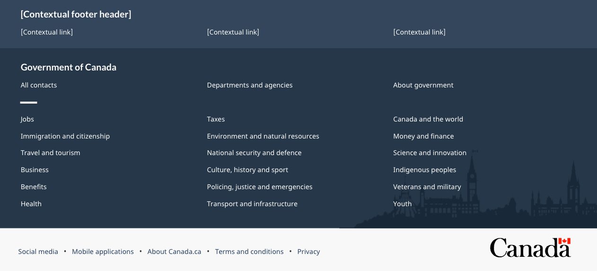
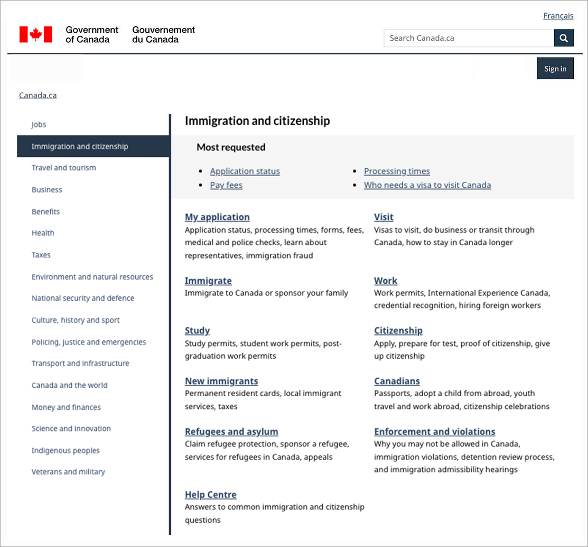
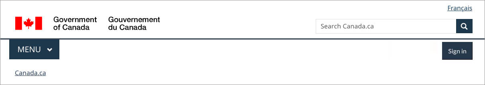

<h1 property="name" id="wb-cont" dir="ltr">Wayfinding on Canada.ca: Research summary</h1>

Date: Dec X, 2022

Government departments and agencies are adopting the Canada.ca design to enhance trust and ease of use through a consistent experience. The design includes core brand elements and navigation patterns. Users need to be able to quickly recognize official government information and services to avoid fraudulent sites. They also need intuitive patterns to navigate and get their tasks done.

One of the core brand elements is the global header, which includes a theme and topic menu. This menu has several pain points. The Digital Transformation Office (DTO) conducted a set of studies to understand  the role and impact of the menu on in-site navigation.

 
<figure class="gc-complex-img mrgn-tp-lg" role="group">
	
	<figcaption>

			
Screenshot of the global header including the theme and topic menu

			
The header includes the Government of Canada signature, a Menu button, and a Canada.ca breadcrumb on the left side of the screen. On the right side of the screen is a language toggle and the Canada.ca search bar.

		
</figcaption>
  </figure>

<h2>On this page</h2>
<ul>
  <li><a href="#understanding_the_problem">Understanding the problem</a></li> 
  <li><a href="#establishing_baseline">Establishing a baseline</a></li>  
  <li><a href="#design_efforts">Design efforts</a></li> 
  <li><a href="#measuring_success">Measuring success</a></li>
  <li><a href="#what_we_learned">What we learned</a></li> 
    <li><a href="#explore_further">Explore further</a></li> 
    <li><a href="#Connect">Connect with the Digital Transformation Office</a></li> 
      <li><a href="#mailing_list">Digital Transformation Office mailing list</a></li> 
  </ul>

<h2 id="understanding_the_problem">Understanding the problem</h2>

Wayfinding is how users assess where they are in a website and plan a route to follow. On Canada.ca, the menu is a way for users to navigate through the site. It displays top-level pages (themes) to help users find answers and services.

While many visits start from a search engine result, the website should support navigation no matter where a user enters the site. This is especially important when they start their journey on the wrong page.

Some departments have expressed concerns about adopting the Canada.ca design as the menu would compete with their existing local menus or not provide any navigational benefit.  For example, Statistics Canada has a statistics menu for the same themes that are present in the Canada.ca menu. Veterans Affairs Canada provides benefits that are similar but different from the benefits in the current menu.

We worked with these and other departments to explore navigation and design options to facilitate the adoption of the Canada.ca design.

The goals of this extensive research study were:

<ul>
<li>explore options to replace the menu</li>
<li>do no harm to existing task success on sites that have already transitioned to the Canada.ca design</li>
<li>improve navigation to top tasks from different themes/departments</li> 
</ul>

We conducted 2 large rounds of task performance usability testing and used web analytics to inform our design sprints. Just as in the studies, the analytics showed that breadcrumbs are used more than the menu:

<ul>
<li>4.7% of visits use the breadcrumbs</li>  
<li>2.6% of visits use the menu</li> 
</ul>

This suggested that it would be possible to replace the menu without affecting task success. We also noticed that people often used the menu to sign into accounts. This suggested that creating a different sign-in route could further reduce the use of the menu.

<h2 id="establishing_baseline">Establishing a baseline</h2>

The initial study in 2019 established a baseline measurement of the top tasks for each participating department. The research compared sites with the Canada.ca design against sites from departments with different designs. At that time, Immigration, Refugees and Citizenship (IRC) had adopted the Canada.ca design, whereas Agriculture and Agri-Food Canada (AAFC), Veterans Affairs Canada (VAC) and Statistics Canada (StatCan) had not.

20 participants tested 12 tasks from those departments to understand pain points with the menu and give us ideas for potential solutions. The participants included:
 
<ul>
<li>international students</li>  
<li>farmers</li>  
<li>veterans</li>  
<li>academics</li>  
  </ul>

The study involved typical tasks users complete on each departmental site, including a scenario that started on a Google search results page.
 
<h3>List of tasks scenarios</h3>

  <table class="table table-striped">
<caption class="wb-inv">List of tasks scenarios</caption>
  <thead> <tr>
      <th scope="col" class="col-sm-4">Tasks</th>
      <th scope="col" class="col-sm-8">Scenarios</th>
    </tr></thead>
  <tbody>
<tr>
     <td>Start on a Google results page with links to Canada.ca URLS and to other sites (trust task)</td>
     <td>Your friend from France won't need a visa to come visit but will need an Electronic Travel Authorization. How much will it cost to apply?</td> 
 </tr><tr>
     <td>Start on a page with the Canada.ca design
Immigration Refugees and Citizenship (IRCC) page to study permit (department navigation task)</td>
     <td>Your Egyptian friend wants to come to a Canadian university this year. How much will it cost to apply for a study permit?</td> 
 </tr><tr>
     <td>Go to IRCC to check status (Canada.ca design - Sign in task)</td>
     <td>Yen applied for a permanent resident card and needs to find out if it has been mailed yet. Find a page where she can enter her user ID and password to get into her Immigration account.</td>
 </tr><tr>
     <td>Agriculture topic for temporary foreign workers (no Canada.ca design navigation between themes)</td>
     <td>You finished researching some ideas for the next farming season. Now you need to find out if there is a special way to hire temporary seasonal farm workers from Mexico.</td> 
 </tr><tr>
     <td>Agriculture to agriculture topic (no Canada.ca theme navigation)</td>
     <td>Your friend is going to start growing wheat this spring in Saskatchewan. Is there crop insurance available there?</td> 
 </tr><tr>
     <td>Agriculture to agriculture topic (no Canada.ca theme navigation)</td>
     <td>That friend wants to understand the market for organic wheat outside Canada. Are there any 2019 reports with a trade overview and consumption trends that might help them?</td> 
 </tr><tr>
     <td>VAC (interdepartmental task)</td>
     <td>Nour is an injured veteran working out her family budget. How much can they expect to receive if her spouse Pat is recognized as her daily caregiver?</td>
 </tr><tr>
     <td>VAC to Child Benefit (CRA)
(inter-theme navigation)</td>
     <td>Like all Canadian parents, Pat and Nour also get monthly Canada Child Benefit payments for their 15 year old son. Will they still get payments next month when he turns 16?</td> 
 </tr><tr>
     <td>VAC caregiver to account (no Canada.ca sign in experience)</td>
     <td>Nour just switched to a new bank. Is it possible for her to change her bank information online somehow for her veterans payments, or would she have to call?</td>   
 </tr><tr>
     <td>StatCan interdepartmental navigation

(removed in Comparison)</td>
     <td>You searched and found these soybean reports but now you need recent numbers. Find estimated soybean production for 2019 in Canada.</td>
 </tr><tr>
     <td>StatCan interdepartmental navigation

(removed in Comparison)</td>
     <td>You have a voice message from someone claiming to be a Statistics Canada interviewer. They say your household was selected to complete the Labour Force Survey. Find the special number for survey participants to call so you can check if it's a real survey.</td>
 </tr><tr>
     <td>Compare with UK to evaluate design options
Gov UK Student visa cost

(removed in Comparison)</td>
     <td>Zak has been accepted into a two-year diploma program in the UK. How much will it cost to apply for a student visa? Start on a Gov.UK page to compare the experience there to the similar task on Canada.ca (for research only, not a measurement task).</td>
    </tr>
</tbody>
</table>

The baseline study gave us insights for solutions to the problems participants experienced, as well as findability and task success rates so we could evaluate proposed designs. As expected, participants had trouble switching between themes on sites not using the Canada.ca design. Another pain point this study highlighted was the lack of a conventional Sign in button.

<h2 id="design_efforts">Design efforts</h2>

To test ways to replace the menu, we built:

<uL>
<li>a new footer that includes links to all themes, with a contextual band above it</li>
<li>a layered theme page with a widget to switch themes easily</li>
<li>a Sign in button to support this top task</li>
  </ul>
  
 <h3>New footer</h3>
 

 
 <figure class="gc-complex-img" role="group">
	
	<figcaption>

			
The redesigned Canada.ca footer

	
The global footer includes 3 distinct bands of links. The first is the new contextual band. It contains a title and 3 contextual links in a single row. The second is the main band. It’s arranged in 3 columns and contains links to “All contacts,” “Departments and agencies,” and “About government.” There is a small decorative line as a break before continuing with links to all themes and audiences. The sub-footer is at the bottom and contains links to “Social media,” “Mobile applications,” “About Canada.ca,” “Terms and conditions,” and “Privacy.” These are all aligned to the left in a single row. It also includes the Canada wordmark in the same row, aligned to the right.

		
</figcaption>
  </figure>

Analysis of footer usage patterns on the home page versus all other pages revealed an opportunity to reduce the set of GC-wide footer links to 3 (“All contacts,” “Departments and agencies,” “About government”). This freed up space to move the links to theme pages there.

The new footer design added an optional contextual band for “Contact us” and other contextual rescue links, while maintaining the Government of Canada contacts and theme links.
 
<h3>New layered theme template</h3>

 
 <figure class="gc-complex-img" role="group">
	
	<figcaption>

			
Redesign of the theme pages with a navigation bar on the left

		
The redesigned theme page has the navigation bar on the left of the page. The right side of the page contains the theme name, most requested links, and topics with descriptions.

		
</figcaption>
</figure> 
 
 

We also created a new layered theme page template that could be accessed through both the breadcrumbs and the footer.

The layered theme template has a navigation bar on the left and a Most requested band on top. Topics for the theme below the Most requested band.

<h3>New contextual Sign in button</h3>
  
Users commonly expect to find a Sign in button at the top right of the page. This is standard across many websites. It’s become a web convention. We added one to support this top task.

 
<figure class="gc-complex-img" role="group">
	
	<figcaption>

			
New header with the optional contextual Sign in button

		
The header includes the Government of Canada signature, a Menu button, and a Canada.ca breadcrumb on the left side of the screen. On the right side of the screen is a language toggle, the Canada.ca search bar, and a Sign in button.

		
</figcaption>
</figure> 
 
 

Once various pieces of the new design came together, we launched another study. This one tested the effectiveness of the prototype and let us finesse the implementation strategy.

<h2 id="measuring_success">Measuring success</h2>

In contrast to other optimization projects where large improvements were expected, in this project we were looking to maintain or, hopefully increase, task success despite removing the menu and changing the design to Canada.ca. We achieved our goal.

18 participants tested 8 tasks from IRCC, AAFC and VAC to compare them with the baseline. We used prototypes with the new designs we had created. We didn’t include tasks from StatCan in this round because we needed more time to experiment with ways to address their need for a local navigation solution. We wanted to focus first on improving global navigation, since that was less complex. We also added 4 new tasks to evaluate and enhance the new designs.
 

  <table class="table table-bordered">
<caption class="wb-inv1">caption needed</caption>
  <thead> <tr>
      <th scope="col" class="col-sm-6"></th>
      <th scope="col" class="col-sm-3">Baseline 2019</th>
      <th scope="col" class="col-sm-3">Comparison 2021</th>    
    </tr></thead>
  <tbody>
<tr>
      <th scope="row">Overall task success</td>
     <td>54%</td>
     <td>61%</td>   
 </tr><tr>
      <th scope="row">Overall findability (found the page where the answer is)</td>
     <td>61%</td>
     <td>66%</td>   
 </tr>
    </tbody></table>
<h2 id="what_we_learned">What we learned</h2>
<h2 id="explore_further">Explore further</h2>
<h2 id="connect">Connect with the Digital Transformation Office</h2>
<h2 id="mailing_list">Digital Transformation Office mailing list</h2>
