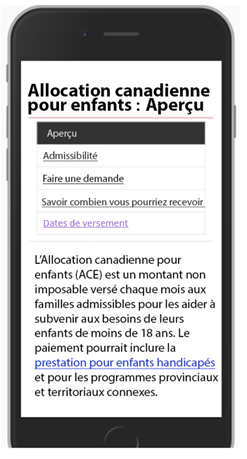
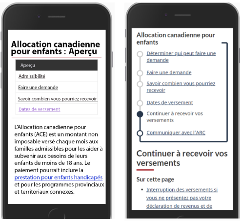
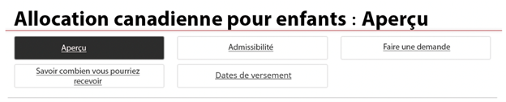
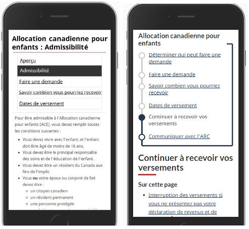
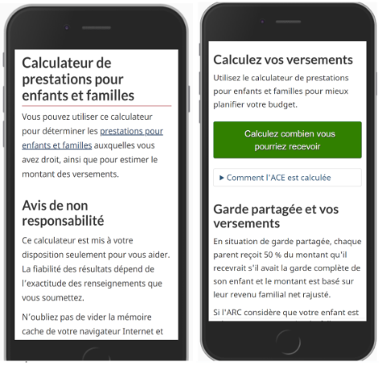

L'allocation canadienne pour enfants (ACE) contribue à réduire la pauvreté infantile au Canada. Au début de 2019, le Bureau de la transformation numérique (BTN) a travaillé en partenariat avec l'Agence du revenu du Canada (ARC) en vue de remodeler les pages consacrées à l'allocation canadienne pour enfants sur Canada.ca. L'objectif de l'équipe était de réduire le nombre d'appels reçu par l'entremise du centre d'appels pour certaines questions fondamentales. Après le lancement des pages remaniées en 2020, le centre d'appels de l'ARC a confirmé que le volume d'appels avait en effet diminué.

Afin de répondre aux besoins des parents qui utilisent un téléphone cellulaire, l'équipe a cocréé un nouveau modèle que nous appelons la navigation de style métro. La conception existante était divisée en différentes étapes, ce qui ne s'avérait pas convivial sur les écrans de téléphones. La représentation visuelle des liens de la nouvelle conception ressemble aux stations d'un plan de métro.

Ce résumé de recherche définit le contexte du projet de recherche dans le cadre duquel le modèle de navigation de style métro a été créé et décrit tous les points qui ont été pris en considération. Il souligne également les autres innovations qui ont écoulé de ce projet.

La navigation de style métro s'est avérée un modèle efficace pour guider les utilisateurs à travers un service qui comporte plusieurs étapes. Les analyses et les tests d'utilisabilité ont montré que ce modèle permet d'aider les utilisateurs à suivre &laquo;&nbsp;la bonne voie&nbsp;&raquo; et qu'il présente de meilleurs taux de repérage et de réussite. L'ARC a par la suite adopté le modèle et l'a utilisé avec succès pour les pages de la Prestation canadienne d'urgence (PCU) et de la Prestation canadienne de la relance économique (PCRE).

Comprendre quand et comment utiliser la navigation de style métro vous permettra de faire emploi de ce puissant modèle correctement.

<h2 id="établir-une-base-de-référence">Établir une base de référence</h2>

En 2019, l'Agence du revenu du Canada (ARC) cherchait à réduire le nombre d'appels de Canadiens qui n'arrivaient pas à trouver ni à comprendre le contenu Web qui explique comment obtenir ou continuer à recevoir leur allocation pour enfants. Le Bureau de la transformation numérique (BTN) s'est associé à l'ARC pour mener à bien cette tâche principale.

La première étape consistait à organiser des ateliers avec divers intervenants, y compris des membres du personnel du centre d'appels. Les ateliers avaient pour but de comprendre quels étaient les principaux facteurs d'appel.

L'équipe a utilisé les données du centre d'appels pour caractériser les problèmes communs. Elle a ensuite généré une série exhaustive de scénarios en situation réelle reflétant les problèmes et les contextes qui étaient à l'origine du volume d'appels le plus important. Elle a utilisé ces données pour créer des scénarios de test en vue d'effectuer des tests de référence et de comparaison.

Parmi les principaux facteurs d'appel, on retrouvait les sujets suivants&nbsp;:

<ul>
  <li>Pourquoi les gens ne reçoivent pas leurs versements (25 %)</li>
  <li>Quel sera le montant de mes versements (12 %)</li>
  <li>Faire une demande d'ACE (10,5 %)</li>
  <li>Dette et somme due (4,3 %)</li>
</ul>

L'équipe a sélectionné une série de ces scénarios pour définir une mesure de référence. Vingt parents canadiens utilisant des téléphones cellulaires ont mis à l'essai ces scénarios dans le cadre d'une étude de rendement liée aux tests d'utilisabilité avec modérateur. Le taux de réussite global était de 28 % pour l'ensemble des sept scénarios de tâches. Cinq scénarios supplémentaires ont fait l'objet d'une mise à l'essai, mais moins de seize participants les ont réussi; ces scénarios n'ont donc pas été pris en considération dans le taux de réussite global.

  

    <figure class="gc-complex-img" role="group">
      <figcaption>
        

          
Scénarios de tâches de la base de référence

          

          

            

              

                <table class="table">
                  <caption class="wb-inv">
                  Scénarios de tâches de la base de référence
                  </caption>
                  <thead>
                    <tr>
                      <th class="col-md-4">Tâche</th>
                      <th class="col-md-8">Scénario</th>
                    </tr>
                  </thead>
                  <tbody>
                    <tr>
                      <td>Versements suspendus</td>
                      <td>
Vous n'avez pas reçu votre versement habituel pour l'ACE en mai ni en juillet. Lesquelles des raisons ci-dessous pourraient faire en sorte que les versements soient suspendus?
</td>
                    </tr>
                    <tr>
                      <td>Calculer le montant de l'allocation</td>
                      <td>
Le deuxième enfant de Mart vient de naître. Quel sera le montant du versement de l'allocation canadienne pour enfants que Mart recevra chaque mois? – Mart habite au Québec, elle est célibataire et a la garde exclusive de ses enfants. Le premier enfant a 2 ans.  Son revenu de l'an dernier était de 60&nbsp;000&nbsp;$.  Elle sera en congé pour les 12 prochains mois, donc elle gagnera seulement 30&nbsp;000&nbsp;$.
</td>
                    </tr>
                    <tr>
                      <td>Date du versement</td>
                      <td>
Référence&nbsp;: Quel jour de juillet, précisément, votre versement de l'allocation canadienne pour enfants sera-t-il effectué?

                        
Optimisation&nbsp;: Quel jour de décembre, précisément, votre versement de l'allocation canadienne pour enfants sera-t-il effectué?
</td>
                    </tr>
                    <tr>
                      <td>Pourcentage de garde partagée</td>
                      <td>
Les enfants de Peter vivent avec son ex-conjointe. Ils vont commencer à venir habiter chez Peter deux fins de semaine par mois. Doit-il demander l'allocation canadienne pour enfants? 
</td>
                    </tr>
                    <tr>
                      <td>Pourcentage de garde partagée</td>
                      <td>
Si vous êtes séparés et que vous partagez la garde de vos enfants, pourriez-vous décider ensemble du pourcentage de l'allocation canadienne pour enfants que chacun de vous recevra? 
</td>
                    </tr>
                    <tr>
                      <td>Versement moins élevé en juillet</td>
                      <td>
Le versement de juillet de l'allocation canadienne pour enfants de Petra a été effectué et il est beaucoup moins élevé que celui qu'elle a reçu en juin. Quelle est la raison la plus probable de ce changement?
</td>
                    </tr>
                    <tr>
                      <td>Changement à votre compte pour le dépôt direct en cours de mois</td>
                      <td>Est-il prudent de fermer votre ancien compte bancaire avant d'avoir reçu votre versement de l'allocation canadienne pour enfants du 20 juin? Vous avez changé de numéro de compte bancaire pour le dépôt direct le 5 juin.</td>
                    </tr>
                  </tbody>
                </table>
              

            

          

          

        

      </figcaption>
    </figure>
  

Les problèmes les plus fréquemment rencontrés par les participants étaient les suivants&nbsp;: ne pas trouver la page sur laquelle se trouvait la réponse à leur question (32 % des participants ont rencontré ce problème) ou ne pas être en mesure de déterminer la bonne réponse à l'aide des renseignements qui se trouvaient sur la page (p. ex., confondre l'admissibilité à l'allocation et le droit à celle-ci).

<h2 id="solutions-de-conception">Solutions de conception</h2>

L'équipe s'est concentrée sur la création d'un prototype de conception qui permettrait de résoudre les problèmes cernés lors du test de référence. Les pages existantes utilisaient le modèle de page de lancement d'un service avec la configuration relative à la navigation dans plusieurs pages ordonnées. Les parents qui accédaient à ces pages au moyen d'un téléphone n'étaient pas en mesure d'utiliser la navigation dans plusieurs pages de manière efficace.

La navigation prenait trop de place dans l'écran et ne reflétait pas la nature groupée des pages.  Certains parents croyaient que les ensembles de pages étaient des options de la section &laquo;&nbsp;Sur cette page&nbsp;&raquo;. Ils avaient aussi tendance à sauter la page &laquo;&nbsp;Aperçu&nbsp;&raquo;.

L'équipe a donc remplacé la configuration relative à la navigation dans plusieurs pages ordonnées par le nouveau modèle de navigation de style métro. Le modèle de navigation de style métro différencie les sections dans un espace plus restreint et affiche les liens entre celles-ci.

  

    <figure class="gc-complex-img" role="group"> 
      <figcaption>
        

          
Description de l'image&nbsp;: ancien modèle de navigation dans plusieurs pages ordonnées de l'allocation canadienne pour enfants

          
L'ancien modèle de lancement d'un service avec navigation dans plusieurs pages ordonnées comportait des liens vers d'autres pages, qui étaient énumérés dans des boîtes individuelles dans la partie supérieure de la page. Le contenu de la page sélectionnée apparaissait en dessous, ce qui donnait l'impression que les liens étaient des liens &laquo;&nbsp;Sur cette page&nbsp;» et non des liens vers des pages connexes contenant des renseignements supplémentaires.

        

      </figcaption>
    </figure>
  

<h3 id="le-modèle-de-navigation-de-style-métro">Le modèle de navigation de style métro</h3>

Le modèle de navigation de style métro comprend ce qui suit&nbsp;:

<ul>
  <li>une page d'index permettant d'accéder à chacune des étapes;</li>
  <li>les pages des étapes, qui comprennent des liens vers les autres étapes;</li>
  <li>des titres descriptifs axés sur les réponses.</li>
</ul>

La page d'index et les pages des étapes utilisent toutes une représentation visuelle des liens entre les étapes qui ressemble à un plan de métro.

<h4 id="nouvelle-page-dindex">Nouvelle page d'index</h4>

Dans le modèle de navigation de style métro, une page d'index remplace la page &laquo;&nbsp;Aperçu&nbsp;&raquo;. Elle comporte un titre, une brève description et un graphique des étapes qui correspond au menu des étapes (les stations de métro). Elle constitue une page d'accueil facile à survoler décrivant chacune des étapes du service. Non seulement les pages d'accueil favorisent le référencement naturel, mais elles soutiennent également l'architecture de l'information. Les utilisateurs peuvent revenir à la page d'index à l'aide du fil d'Ariane.

<h4 id="pages-des-étapes">Pages des étapes</h4>

Dans le modèle original de page de lancement d'un service avec la configuration relative à la navigation dans plusieurs pages, les gens éprouvaient des problèmes à naviguer d'une page à l'autre et cliquaient souvent sur le bouton de la page sur laquelle ils se trouvaient déjà.  La configuration de navigation de style métro rend les étapes plus claires sans répéter le titre et place la configuration &laquo;&nbsp;Sur cette page&nbsp;&raquo; après les liens de navigation de style métro. Sur un ordinateur de bureau, les liens de navigation de style métro apparaissent du côté droit de l'écran.

  

    <figure class="gc-complex-img" role="group"> 
      <figcaption>
        

          
Description de l'image&nbsp;: l'ancien et le nouveau modèle de navigation de l'allocation canadienne pour enfants

          
(Première image) Ancienne navigation dans plusieurs pages. (Deuxième image) La navigation de style métro permet de bien distinguer les liens des pages des étapes de la présentation &laquo;&nbsp;Sur cette page&nbsp;». Le titre &laquo;&nbsp;Continuer à recevoir vos versements&nbsp;» apparaît sous les liens de navigation de style métro. 

        

      </figcaption>
    </figure>
  

<h4 id="nouveaux-titres-descriptifs-axés-sur-les-réponses">Nouveaux titres descriptifs axés sur les réponses</h4>

Dans le modèle de page de lancement d'un service avec la navigation dans plusieurs pages, les titres des pages s'affichent sous la forme de boutons sans espace pour la description. Le renvoi à la ligne brise l'alignement, donc les concepteurs de contenu limitent souvent les mots pour contrôler la taille des boutons. Dans l'étude de référence, il était donc plus difficile pour les gens de choisir le bon bouton, car les libellés n'étaient pas suffisamment clairs.

  

    <figure class="gc-complex-img" role="group"> 
      <figcaption>
        

          
Description de l'image&nbsp;: capture d'écran du menu de navigation de l'allocation canadienne pour enfants

          
Capture d'écran d'un menu de navigation. L'en-tête est Allocation canadienne pour enfants&nbsp;: Aperçu. Les options de navigation sont Aperçu, Admissibilité, Faire une demande, Savoir combien vous pourriez recevoir, Dates de versement.

        

      </figcaption>
    </figure>
  

Dans le modèle de navigation de style métro, le texte des liens peut être plus long. La page d'index comporte un espace pour afficher une description sous chaque lien.

  

    <figure class="gc-complex-img" role="group">
      <figcaption>
        

          
Description de l'image&nbsp;: modèle de navigation de style métro de l'allocation canadienne pour enfants

          
Vue sur ordinateur de bureau de la page d'index de l'ACE, où chaque page d'étape est énumérée. Les titres de chaque page d'étape abordent les questions couramment reçues au centre d'appels. Elles sont&nbsp;: Qui peut faire une demande, Faire une demande, Savoir combien vous pourriez recevoir, Dates de versement, Continuer à recevoir vos versements, Communiquer avec l'ARC. Sous chaque titre se trouve une courte description de ce que les utilisateurs peuvent trouver sur la page.

        

      </figcaption>
    </figure>
  

<h3 id="solutions-de-conception-de-contenu">Solutions de conception de contenu</h3>

Le projet d'optimisation comprenait de nombreuses autres modifications positives axées sur les réponses plutôt que sur les questions. En plus du passage à la navigation de style métro, l'équipe a apporté les modifications suivantes&nbsp;:

<ul>
  <li>elle a retiré des publications;</li>
  <li>elle a reformulé les titres dans un langage clair et simple à l'aide de mots-clés liés aux réponses;</li>
  <li>elle a ajouté des choix afin de réduire la complexité;</li>
  <li>elle a retiré  l'avis de non-responsabilité qui bloquait l'accès;</li>
  <li>elle a supprimé le contenu qui apparaissait en double.</li>
</ul>
<h4 id="retrait-de-publications">Retrait de publications</h4>

Les réponses que les utilisateurs cherchent à trouver doivent être intégrées au contenu des pages groupées. Dans le test de référence, certaines réponses concernant la garde figuraient dans un &laquo;&nbsp;carnet&nbsp;&raquo; en format PDF que certains participants refusaient d'ouvrir à partir de leur téléphone. Dans l'étude comparative, nous avons intégré les réponses du carnet directement dans les pages des étapes utilisées dans la navigation de style métro. Cette intégration a permis de faire en sorte que toutes les tâches liées à la garde affichaient un taux de réussite de 100 %, alors que les taux de référence affichaient des taux de réussite de moins de 50 %.

<h4 id="reformulation-des-titres-dans-un-langage-clair-et-simple-à-laide-de-mots-clés-liés-aux-réponses">Reformulation des titres dans un langage clair et simple à l'aide de mots-clés liés aux réponses</h4>

Nous avons reformulé les titres des pages et les en-têtes pour répondre aux principales questions des utilisateurs. Par exemple, les participants à l'étude de référence ont effectué une recherche au moyen du terme &laquo;&nbsp;Faire une demande&nbsp;&raquo; pour savoir &laquo;&nbsp;qui peut faire une demande&nbsp;&raquo; ainsi que pour savoir &laquo;&nbsp;comment demeurer admissible&nbsp;&raquo;. Le modèle de navigation de style métro comportait des titres de pages distincts pour chacune des réponses.

  

    <figure class="gc-complex-img" role="group">
      <figcaption>
        

          
Description de l'image&nbsp;: ancien et nouveau modèle de conception avec les titres de pages adaptés

          
L'ancienne conception comprenait les pages suivantes&nbsp;: Aperçu, Admissibilité, Faire une demande, Savoir combien vous pourriez recevoir et Dates de versement. Dans la nouvelle conception, les titres de page ont été adaptés pour correspondre à ce que les gens recherchent&nbsp;: Déterminer qui peut faire une demande, Faire une demande, Savoir combien vous pourriez recevoir, Dates de versement, Continuer à recevoir vos versements, Communiquer avec l'ARC.

        

      </figcaption>
    </figure>
  

<h4 id="réduire-la-complexité-à-laide-du-choix">Réduire la complexité à l'aide du choix</h4>

Les pages originales contenaient peu d'en-têtes qui étaient enfouis dans de longs blocs de texte expliquant chaque situation. Les gens avaient de la difficulté à trouver les réponses à partir de leur téléphone.

Dans l'étude comparative, l'équipe a utilisé <a href="https://conception.canada.ca/configurations-conception-communes/contenu-reductible.html">le modèle afficher/masquer</a> pour masquer les réponses s'adressant à des groupes de personnes particuliers. Cette approche a été très concluante pour réduire la longueur des pages et pour aider les gens à choisir la réponse appropriée à leur situation.

<h4 id="retrait-de-lavise-de-non-responsabilité-bloquant-laccès">Retrait de l'avise de non-responsabilité bloquant l'accès</h4>

Sur le site Web en ligne, un long avis de non-responsabilité bloquait l'accès à un important outil de calcul des prestations, et il fallait cliquer sur le bouton &laquo;&nbsp;J'accepte&nbsp;&raquo; qui se trouvait sous la mise en garde pour être en mesure de le lancer. Les participants ne faisaient pas défiler l'avis de non-responsabilité pour atteindre le bouton, et certaines personnes qui trouvaient ce bouton hésitaient à cliquer sur &laquo;&nbsp;J'accepte&nbsp;&raquo;.  L'équipe a déplacé l'avis de non-responsabilité à la phase de réponse de l'outil, où il était pertinent de l'afficher, et a retiré l'étape &laquo;&nbsp;J'accepte&nbsp;&raquo;.

  

    <figure class="gc-complex-img" role="group"> 
      <figcaption>
        

          
Description de l'image&nbsp;: retrait de l'avis de non-responsabilité de l'allocation canadienne pour enfants 

          
 Sur la première capture d'écran, l'ancienne conception affiche d'abord l'avis de non-responsabilité, qui occupe l'ensemble de l'écran sur les téléphones mobiles et cache l'outil de calcul. Sur la deuxième capture d'écran, la nouvelle conception utilise un bouton vert de super tâche pour attirer l'attention sur l'outil de calcul. L'avis de non-responsabilité ne se trouvant pas sur cette page, elle ne gêne pas la navigation.

        

      </figcaption>
    </figure>
  

<h4 id="autres-améliorations">Autres améliorations</h4>

Depuis la fin du projet d'optimisation, l'ARC a élaboré des sous-étapes qui aideront les utilisateurs à se concentrer sur des parties précises de leur parcours. Consultez le récent billet de blogue sur le modèle de navigation de style métro pour comprendre les nouveaux changements apportés au modèle.

<h2 id="mesure-des-résultats">Mesure des résultats</h2>

Le taux de réussite global des tâches est passé de 28 % à 83 % lorsque le BTN a à nouveau mise à l'essai les scénarios de tâches du prototype. Cela a poussé l'ARC à modifier rapidement les pages en ligne pour refléter la nouvelle conception.

<strong>Les volumes d'appels ont diminué</strong>&nbsp;: les pages remaniées ont été mises en ligne en décembre 2019. Au cours du premier trimestre de 2020, le nombre d'appels reçus par l'ACE pour demander &laquo;&nbsp;Quel sera le montant de mes versements&nbsp;&raquo; a diminué de plus de 50 %. À l'inverse, les appels visant à poser la même question pour le crédit lié à la TPS, dont les pages n'avaient pas été remaniées, n'ont pas diminué au cours de cette même période.

<strong>Augmentation de l'utilisation du calculateur</strong>&nbsp;: l'utilisation du calculateur de prestations a doublé après que la page fut renommée &laquo;&nbsp;Combien vous pourriez recevoir&nbsp;&raquo; et que le lien vers le calculateur a été mis en évidence à l'aide d'un bouton vert. Entre avril et juin 2020, le nombre de visites sur la page en anglais du calculateur de prestations a presque doublé par rapport à ce qu'il était en 2019, totalisant 609 703 visites en 2020 par rapport à 341 492 visites en 2019. Les visites sur la page en français sont aussi passées de 76 124 en 2019 à 118 956 en 2020.

<h2 id="ce-que-nous-avons-appris">Ce que nous avons appris</h2>

<strong>Faire participer le centre d'appels aux projets d'optimisation.</strong> La collaboration avec l'équipe du centre d'appels s'est avérée une étape cruciale pour atteindre l'objectif de réduire le nombre d'appels. Assurez-vous de connaître les principaux facteurs d'appel et d'organiser le contenu de manière à répondre à ces questions plutôt que de simplement fournir l'ensemble des renseignements et de laisser les personnes chercher elles-mêmes les réponses.

<strong>Adaptez votre conception pour les utilisateurs d'appareils mobiles.</strong> Pour les services où l'utilisation d'appareils mobiles est élevée, le modèle de navigation de style métro constitue une amélioration importante par rapport à la navigation par onglets dans plusieurs pages. Il permet de diviser des étapes uniques sur plusieurs pages qui illustrent clairement les étapes et le cheminement sur un téléphone.

Le modèle de navigation de style métro a amélioré la navigation pour de nombreux services offerts par l'ARC. Cela a commencé par l'allocation canadienne pour enfants, puis il a ensuite été largement utilisé dans le cadre des communications relatives aux prestations liées à la COVID-19 pendant la pandémie. L'ARC a continué à réaliser des tests d'utilisabilité et a amélioré davantage la conception, comme on peut le constater en visitant les nouvelles pages liées aux prestations.

D'autres ministères ont commencé à utiliser le modèle de navigation de style métro en raison de son utilité et de sa souplesse. Avant d'avoir recours à ce modèle, il est important de savoir quand l'utiliser et comment préparer le contenu pour qu'il fonctionne bien avec ce modèle.

<h2 id="pour-en-savoir-plus">Pour en savoir plus</h2>
<ul>
  <li><a href="https://conception.canada.ca/configurations-conception-communes/navigation-metro.html">Navigation de style métro</a></li>
  <li><a href="https://conception.canada.ca/modeles-recommandes/pages-lancement-service.html">Pages de lancement d'un service — Modèle de Canada.ca</a></li>
  <li><a href="https://conception.canada.ca/configurations-conception-communes/navigation-plusieurs-pages.html">Navigation dans plusieurs pages ordonnées</a>
    <ul>
      <li>On l'utilise pour exposer les grandes lignes du contenu qui s'étend sur plusieurs pages et qui a un ordre par défaut ou préféré.</li>
    </ul>
  </li>
</ul>
