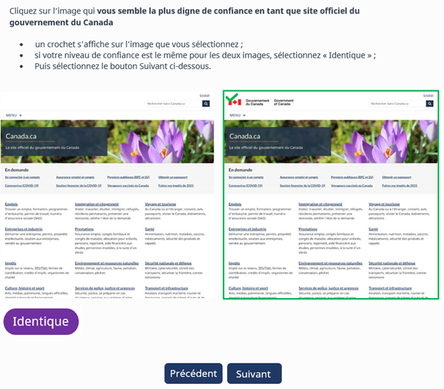
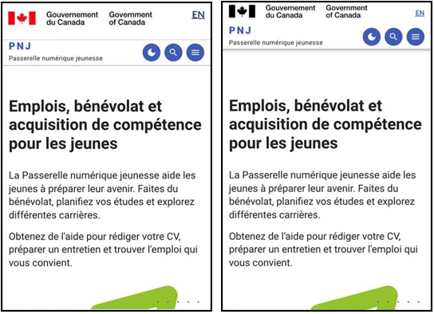

Le Canada connaît un nombre sans précédent de cas de fraude ces dernières années<a class="fn-lnk" href="#fn1">Note de bas de page 1</a>. Dans la plupart de ces cas, on a recours à la technologie pour cibler ses victimes. Il est donc plus important que jamais de veiller à ce que les utilisateurs soient en mesure de reconnaître les sites Web officiels du gouvernement du Canada (GC).

Préserver une cohérence sur le plan de la conception est crucial pour obtenir la confiance des utilisateurs. De plus, des recherches antérieures effectuées dans le cadre du projet Orientation semblent montrer que l’usage d’éléments de communication graphiques cohérents sur les sites du gouvernement du Canada contribue à renforcer la confiance.

Le Bureau de la transformation numérique (BTN) a mené une étude sur la confiance afin de déterminer lesquels des éléments de communication graphiques inspirent le plus de confiance aux utilisateurs par rapport à la marque du gouvernement du Canada. Au cours de l’étude, les sondeurs ont mesuré et comparé le niveau de confiance des personnes interrogées concernant les éléments suivants :

<ul>
  <li>Symbole du drapeau du Programme de coordination de l’image de marque (PCIM)</li>
  <li>Domaine Canada.ca</li>
  <li>Bouton de menu thématique</li>
  <li>Bouton de connexion</li>
</ul>

Les résultats montrent que le PCIM est essentiel à la marque et doit être en couleur (rouge). Le domaine Canada.ca et un modèle de connexion cohérent ont également été déterminés comme étant des éléments importants pour ce qui est de la confiance des utilisateurs. En revanche, le bouton de menu thématique ne constitue pas un élément essentiel pour gagner leur confiance.

<h2 id="méthode">Méthode</h2>

Du 9 au 22 juin 2022, nous avons réalisé une étude interactive sur la confiance auprès de 2 726 personnes recrutées directement au moyen d’une invitation lancée sur les sites Canada.ca. Au total, quatre versions de l’étude ont été créées, dans les deux langues officielles et dans les formats pour téléphone cellulaire et ordinateur. 48 % des participants à l’étude ont répondu depuis le Canada. 78 % d’entre eux ont utilisé le questionnaire en anglais et 73 % ont répondu à toutes les questions.

Pour chaque question, les personnes voyaient s’afficher deux images d’éléments de la marque présentant de légères variations. Chaque fois, elles devaient désigner l’image qui leur semblait la plus digne de confiance. Si leur niveau de confiance était le même pour les deux images, elles avaient la possibilité de l’indiquer.

  

    <figure class="gc-complex-img" role="group"> 
      <figcaption>
        

          
Description de l'image : exercice interactif sur la confiance

          
Un échantillon de l'expérience d'enquête pour les personnes interrogées sur ordinateur. Deux pages Web similaires de Canada.ca sont affichées côte à côte. L’étude demande aux participants de cliquer sur l’image qui leur semble la plus digne de confiance en tant que site officiel du gouvernement du Canada. Si leur niveau de confiance était le même pour les deux images, ils devaient cliquer sur &laquo;&nbsp;Identique&nbsp;&raquo;.

        

      </figcaption>
    </figure>
  

Avant de lancer officiellement l’étude, nous avons réalisé une étude pilote auprès de 35 personnes, auxquelles nous avons demandé d’expliciter leurs réponses lors de sessions d’enregistrement d’écran. Cette phase qualitative a permis à la fois d’affiner la conception de l’étude et de comprendre dans le détail les logiques et moteurs qui motivent les décisions des personnes. Nous avons également voulu tester la capacité des gens à faire la différence entre confiance et préférence.

Ces premières réponses ont montré que, même si les notions de confiance et de préférence peuvent se recouper un peu, la plupart des personnes font la distinction. Lorsqu’elles désignent un élément comme étant digne de confiance, elles utilisent fréquemment des termes tels que &laquo;&nbsp;sûr&nbsp;&raquo;, &laquo;&nbsp;officiel&nbsp;&raquo;, &laquo;&nbsp;professionnel&nbsp;&raquo;. Dans la section des commentaires de clôture, elles ont souvent mentionné le symbole du drapeau, dans le coin supérieur gauche.

<h2 id="les-enseignements-de-létude">Les enseignements de l’étude</h2>

L’étude démontre que le symbole du drapeau rouge du PCIM, suivi de la signature du gouvernement du Canada, est essentiel à la confiance envers la marque Canada.ca. La grande majorité des personnes interrogées lui font davantage confiance que le mot-symbole &laquo;&nbsp;Canada&nbsp;&raquo; ou toute autre version de la signature du GC.

  

    <figure class="gc-complex-img" role="group">
      <figcaption>
        

          
Description de l'image : symbole PCIM du gouvernement du Canada

          
L'étude a montré que cette version du PCIM est l'élément auquel les participants accordent le plus de confiance.

        

      </figcaption>
    </figure>
  

Seules 8 % des personnes interrogées ont considéré la page sans drapeau comme digne de confiance. Le drapeau a souvent été mentionné, avec des commentaires tels que les suivants : 

<ul>
  <li>&laquo;&nbsp;Le drapeau me donne l’impression que le site est plus sûr&nbsp;&raquo;</li>
  <li>&laquo;&nbsp;Le fait d’avoir la marque &laquo;&nbsp;gouvernement du Canada&nbsp;&raquo; dans les deux langues officielles, avec le drapeau, me donne plus confiance&nbsp;&raquo;</li>
  <li>&laquo;&nbsp;Le drapeau a plus de sens, l’autre ne fait pas officiel&nbsp;&raquo;</li>
</ul>
<h3 id="le-rouge-inspire-plus-de-confiance-que-le-noir-et-blanc">Le rouge inspire plus de confiance que le noir et blanc</h3>

Lorsqu’on leur montre le symbole officiel du drapeau du PCIM en rouge ainsi qu’en noir et blanc, des participants indiquent avoir davantage confiance dans la version couleur du drapeau. Selon l'étude :
 
<ul>
  <li>74 % des personnes font plus confiance au drapeau coloré.</li>
  <li>5 % des personnes font confiance au drapeau noir et blanc.</li>
  <li>21 % d’entre elles ont indiqué que les deux drapeaux leur inspiraient le même niveau de confiance.</li>
</ul>  

Les résultats obtenus sont cohérents, quels que soient l’âge des personnes interrogées et le type d’appareil utilisé pour répondre à l’étude.

Plus spécifiquement, les personnes interrogées privilégient un arrière-plan blanc qui fait ressortir le drapeau, même en mode sombre. Les commentaires reçus sur la version noir et blanc sont sans équivoque. En voici quelques-uns :

<ul>
  <li>&laquo;&nbsp;Le drapeau en haut à gauche devrait être en couleur&nbsp;&raquo;</li>
  <li>&laquo;&nbsp;Le drapeau à la feuille d’érable est celui qui m’inspire le plus confiance&nbsp;&raquo;</li>
  <li>&laquo;&nbsp;Le drapeau doit être rouge et blanc, pas noir et blanc&nbsp;&raquo;</li>
</ul>

  

    <figure class="gc-complex-img" role="group">
      <figcaption>
        

          
Description de l'image : test du symbole PCIM du gouvernement du Canada

          
À gauche, une page liée aux emplois pour les jeunes affiche la version couleur du symbole du drapeau du PCIM. À droite, la même page affiche le symbole en noir et blanc.

        

      </figcaption>
    </figure>
  

<h3 id="le-domaine-canadaca-plus-digne-de-confiance-que-le-domaine-gcca">Le domaine Canada.ca plus digne de confiance que le domaine .gc.ca</h3>

Dans le cadre de l’étude, les personnes interrogées ont été invitées à faire leur choix entre des URL utilisant le domaine Canada.ca et le domaine gc.ca. En fin de compte, 60 % d’entre elles ont déclaré que l’URL Canada.ca leur inspirait plus de confiance qu’une URL .gc.ca similaire. L’URL Canada.ca est particulièrement importante pour les nombreuses personnes qui ont appris qu’elles devraient davantage se fier aux URL qu’à la conception des pages.

<ul>
  <li>&laquo;&nbsp;L’URL inclut le domaine canada.ca. et commence même par lui. Si ce n’était pas le cas, j’aurais peur qu’il s’agisse d’un site non officiel ou falsifié&nbsp;&raquo;.</li>
</ul>
<h3 id="le-bouton-de-menu-nest-pas-essentiel-à-la-marque">Le bouton de menu n’est pas essentiel à la marque</h3>

D’après les résultats de l’étude, le bouton de menu n’est pas essentiel à la confiance des utilisateurs. Dans les questions portant sur des conceptions avec et sans bouton de menu, 41 % des personnes interrogées ont estimé qu’il n’y avait pas de différence. Ce résultat peut indiquer qu’ils n’avaient pas remarqué la différence ou que les deux conceptions leur inspiraient le même niveau de confiance. Il s’agit par ailleurs de la seule question de l’étude pour laquelle le nombre de personnes qui ont déclaré ne pas voir de différence a été plus important que sur les autres réponses possibles.

<h3 id="le-modèle-de-connexion-doit-être-cohérent-pour-tous-les-comptes">Le modèle de connexion doit être cohérent pour tous les comptes</h3>

La connexion à un compte est parfois associée à des tentatives d’hameçonnage et d’usurpation d’identité. Nous avons donc voulu désigner le modèle de connexion qui inspirait le plus confiance aux personnes interrogées. Une des questions de l’étude portait sur différentes conceptions de page de connexion à un compte. Sur l’une d’entre elles était affiché un bouton vert de &laquo;&nbsp;super-tâche&nbsp;&raquo;, courant sur les sites Canada.ca. L’autre version comportait des boutons bleus et rouges uniques. 43 % des personnes interrogées ont indiqué avoir plus confiance dans la page affichant des boutons verts. 37 % d’entre elles ont désigné la page affichant des boutons uniques.

Toutes ont souligné l’importance de la cohérence et du caractère familier des pages de connexion. Elles attendent de la marque Canada.ca une conception cohérente qui leur permette d’échapper aux tentatives de fraude.

<h2 id="autres-résultats">Autres résultats</h2>

Les derniers commentaires ouverts des personnes interrogées laissent entrevoir le souhait d’une meilleure expérience utilisateur. Les utilisateurs souhaitent que Canada.ca soit plus simple et plus fonctionnel. Nous encourageons les ministères à optimiser continuellement leur présence sur le Web, en s’appuyant sur les recherches et les données probantes obtenues. Des outils tels que le Sondage sur la réussite des tâches du GC et l’outil de rétroaction sur la page peuvent vous aider à recueillir ces données pour décider des améliorations à apporter.

<a href="https://conception.canada.ca/sondage/index.html">Sondage sur la réussite des tâches</a> : ce sondage en ligne qui se déroule en continu comprend des questions sur trois sujets principaux, à savoir la réussite des tâches, ainsi que la facilité et la satisfaction de l’utilisation.

<a href="https://conception.canada.ca/amelioration-continue/mesure/retroaction.html">Outil de rétroaction sur la page</a> : cet outil permet aux utilisateurs de fournir des commentaires sur la page sur laquelle ils se trouvent. Il peut ainsi aider les ministères à cerner des problèmes courants dans leur contenu.

<h2 id="prochaines-étapes">Prochaines étapes</h2>

À la suite de cette recherche, nous avons mis à jour les directives relatives à l’en-tête général dans le système de conception de Canada.ca pour tenir compte de l’importance que les personnes accordent au symbole du drapeau rouge du PCIM. Nous continuons de travailler avec les ministères et organismes pour non seulement assurer l’adoption complète de la conception Canada.ca, y compris le domaine Canada.ca, mais aussi élaborer un modèle de connexion cohérent.

  

    

      <dl>
        <dt>Note de bas de page 1</dt>
        <dd id="fn1">
          
<a href="https://www.rcmp-grc.gc.ca/fr/nouvelles/2023/mois-prevention-fraude-2023-pertes-liees-a-fraude-atteignent-nouveau-record">Mois de la prévention de la fraude 2023 : Les pertes liées à la fraude atteignent un nouveau record historique au Canada | Gendarmerie royale du Canada (rcmp-grc.gc.ca)</a>

          
<a href="#fn1">Return to footnote 1 referrer</a>

        </dd>
      </dl>
    

  

