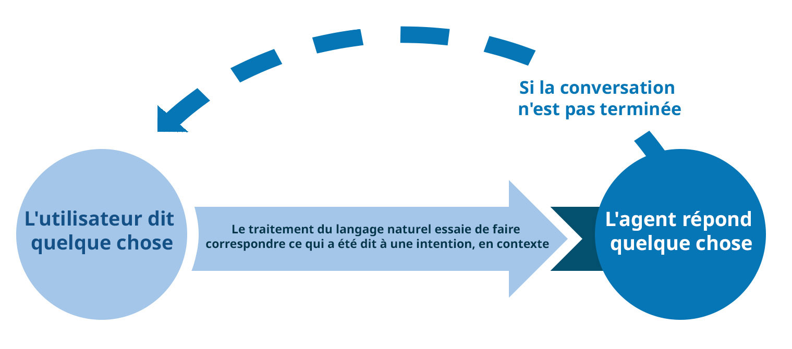
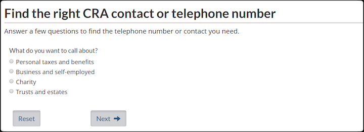
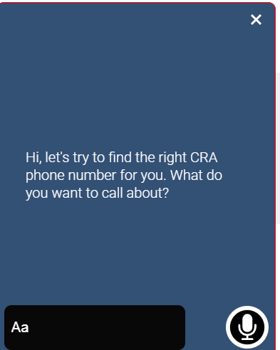
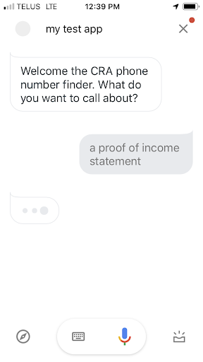
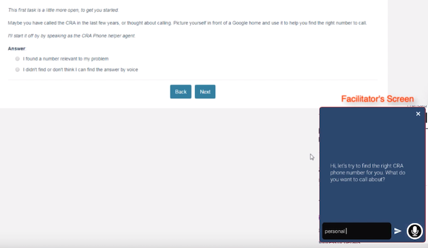

Les Canadiens recherchent des réponses des gouvernements sur tous les appareils dont ils disposent – sur leur téléphone portable, leurs tablettes, leurs ordinateurs, et de plus en plus avec leur voix. Nous voulions en savoir plus sur la façon dont divers types d’interaction pouvaient aider les utilisateurs à trouver les réponses qu’ils recherchaient.

Dans le cadre d’un de nos projets d’optimisation, nous avons entrepris d’améliorer la réussite des Canadiens qui communiquent avec l’Agence du revenu du Canada. Nous avons expérimenté divers types de conceptions d’interactions.

Nous avons élaboré un assistant de recherche de numéros de téléphone ainsi qu’un agent expérimental qui fonctionnait à la fois comme robot conversationnel (*chatbot*) sur un écran et comme agent vocal, afin de pouvoir comparer les processus de conception et les résultats de chacun.

## Définitions

Avant de plonger dans notre expérience, passons en revue quelques définitions. Puisque ce champ évolue rapidement, les définitions ont tendance à changer souvent.

### Interactions à tours multiples

Les interactions à tours multiples sont celles où se produit une séquence d’échanges pour obtenir la bonne réponse. Elles exigent une logique dans la séquence pour aider les personnes à obtenir seulement la réponse pertinente à leur situation.

Les assistants interactifs sont un exemple d’interaction à tours multiples.

### Assistants interactifs

Les assistants interactifs utilisent un ensemble de questions interactives pour aider les personnes à choisir parmi les options possibles pour obtenir la réponse dont ils ont besoin.

Les assistants deviennent assez communs. Il a été démontré qu’ils augmentent la réussite des tâches dans plusieurs de nos projets d’optimisation.

- [Article de blogue&nbsp;: Les questions interactives pour aider les gens](https://blogue.canada.ca/2021/04/08/utilisation-de-questions-interactives)

### Agents conversationnels&nbsp;: robots conversationnels (chatbots) et agents vocaux

Pour nos besoins, nous définirons les agents conversationnels comme des agents virtuels qui utilisent la conversation pour obtenir des réponses pour les gens.

La conversation peut être&nbsp;:

- textuelle (comme dans un robot conversationnel sur une page Web)
- vocale (comme lorsque vous utilisez un haut-parleur intelligent)
- hybride (comme utiliser Google Assistant sur votre téléphone)

Les agents conversationnels poussent l'interaction avec les utilisateurs plus loin qu'un assistant. Ils permettent aux gens de poser des questions dans leurs propres mots. Les conversations suivent le flux de l’utilisateur, plutôt que de les forcer à entrer dans une séquence précise.

Une conception d’interaction vocale bien conçue semble être un rêve de convivialité&nbsp;:

-  les gens n’ont pas à apprendre la conception – ils savent déjà comment parler
- les gens peuvent parler selon leurs propres mots, plutôt que d’être forcés d’utiliser les mots que vous mettez sur une page Web
- l’interaction vocale est accessible aux personnes ayant une déficience visuelle

## Fonctionnement des agents conversationnels

Pour ce projet, nous avons utilisé un outil de Google appelé DialogFlow™. La terminologie que nous utilisons provient de cet outil. La terminologie peut varier en utilisant d’autres outils, mais les principes demeurent les mêmes.

Les agents conversationnels fonctionnent ainsi:

- l’utilisateur tape ou dit quelque chose pour exprimer ce qu’il veut savoir – « *Quel numéro dois-je appeler pour une question sur mon compte d’impôt?* »
-  l’agent fait correspondre ce que l’utilisateur a exprimé à l’une des « intentions » (« intents ») préconçues dans l’agent
  - l’ensemble des réponses possibles est basé sur le contexte de la conversation – sur ce que l’utilisateur a déjà dit, et sur les réponses que l’agent a déjà fournies
- l’agent répond à l’utilisateur avec une réponse préconçue pour cette situation&nbsp;: « *Voulez-vous appeler au sujet de votre compte d’impôts personnels ou d’un compte d’impôts pour les entreprises*? »
- le cycle redémarre, si la conversation n’est pas terminée

{: .mrgn-tp-lg}

Fonctionnement des agents conversationnels

Un exemple visuel du fonctionnement d'un agent conversationnel. L'utilisateur dit quelque chose. Le traitement du langage naturel essaie de le faire correspondre à une intention, dans le contexte. Ensuite, l'agent répond quelque chose. Si la conversation n'est pas terminée, le cycle se répète.

La « magie » des agents conversationnels réside dans le traitement du langage naturel – une forme d’intelligence artificielle. L’agent utilise le traitement du langage naturel pour analyser à la fois la syntaxe et la sémantique de la conversation en se basant sur un vaste jeu de données de langage de conversation. Par conséquent, si un utilisateur dit « J’aimerais », l’agent peut comprendre cela pour faire une correspondance à une intention qui dit « Je voudrais ... » et une intention qui dit « Je veux ».

## Création d’un agent conversationnel

Pour le moment, il n’existe pas de méthode magique pour transformer le contenu Web existant en agent conversationnel. Vous devez concevoir l’agent, et chaque intention, à l’aide du **design conversationnel**. Pour ce faire, vous devez effectuer des recherches et élaborer des flux de conversation.

La meilleure façon de commencer ce processus est de comprendre les éléments dont vous avez besoin pour être en mesure de fournir une bonne réponse. Commencer par un assistant interactif est une bonne idée – vous saurez déjà quelles questions poser pour fournir une réponse à ce sujet. Par exemple, pour un assistant interactif pour visiter le Canada, vous devez savoir de quel pays la personne vient.

Rédigez quelques exemples de dialogues qui pourraient donner les mêmes réponses que votre assistant interactif, puis essayez-les avec de vraies personnes. Si possible, collaborez avec vos collègues du centre d’appels pour comprendre comment les conversations se déroulent dans le monde réel. Lorsque vous écrivez vos exemples de dialogue, imaginez l’échange idéal que vous souhaiteriez entre l’agent et l’utilisateur. Cela vous permet de voir comment les tours de parole et les sauts de tour peuvent se produire.

Une fois que vous avez écrit quelques dialogues pour les « parcours réussis » de votre agent, vous devriez aussi écrire des exemples de dialogues pour les parcours « moins réussis ». Cela vous permet de voir ce qui pourrait se produire lorsque l’utilisateur n’interagit pas de manière idéale avec l’agent. Encore une fois, testez-les avec de vraies personnes. Vous pouvez prétendre être l’agent pour avoir une idée de la façon dont la conversation pourrait se dérouler. Ce style de test est appelé « test Magicien d’Oz » parce que vous parlez et pensez pour l’agent conversationnel.

Lorsque vous savez comment les conversations peuvent se dérouler et comment l’agent conversationnel doit interagir avec les gens, vous pouvez commencer à élaborer l’ensemble des « intentions » pour orienter l’agent dans les conversations. Ensuite, testez à nouveau…

## L’expérience conversationnelle

Au début de janvier 2019, le Bureau de la transformation numérique du Secrétariat du Conseil du Trésor du Canada a commencé à travailler sur un projet d’optimisation avec l’Agence du revenu du Canada. Dans le cadre du projet, nous essayions d’aider les gens à trouver le bon numéro de téléphone à appeler pour leur question particulière.

 Avec les équipes du centre d’appels et les équipes Web, nous avons conçu un ensemble de scénarios de tâches réalistes. Les scénarios ont été réalisés dans le cadre de séances d’essais de convivialité, où nous avons demandé aux participants de trouver les réponses aux scénarios sur le site Web. Ensuite, nous avons testé des améliorations au site pour résoudre les problèmes que nous avons vus dans le test de base. Nous avons ensuite testé les mêmes scénarios de tâches avec un nouvel ensemble de participants.

### Prototypes

Pour vérifier si un agent conversationnel peut contribuer à améliorer la réussite des tâches, nous avons créé 3 outils d’interaction à tours multiples distincts&nbsp;:

- **un assistant interactif** où les utilisateurs ont sélectionné des options sur la page Web
- **un robot conversationnel** où les utilisateurs l’ont ouvert sur la page Web et ont interagi en tapant
- **un assistant vocal** où les utilisateurs ont interagi avec leur voix au moyen de Google Home ou d’un assistant Google sur un téléphone

{: .mrgn-tp-lg}

Assistant (en anglais seulement)

L'assistant "Trouver le bon contact ou numéro de téléphone de l'ARC" affiche des questions sur votre appel pour vous guider vers la réponse dont vous avez besoin.

{: .mrgn-tp-lg}

Agent conversationnel (en anglais seulement)

Le chatbot de l'ARC qui apparaît au bas de votre écran. Il affiche le texte "Bonjour, essayons de trouver le bon numéro de téléphone de l'ARC pour vous. À quel sujet voulez-vous appeler ?" Les gens tapent ensuite leur réponse pour obtenir une réponse.

{: .mrgn-tp-lg}

Agent vocal de l’assistant Google (en anglais seulement)

Le chercheur de numéros de téléphone ARC est un assistant vocal Google. Le texte suivant s'affiche : "Bienvenue dans le moteur de recherche de numéros de téléphone de l'ARC. À quel sujet voulez-vous appeler ?" La réponse est "une déclaration de preuve de revenus".

### Comment nous avons testé la conception

Nous avons divisé les tests en 2 parties.

Dans la **partie 1**, les participants pouvaient utiliser n’importe quelle section des pages Web du prototype pour essayer de trouver les réponses. Ils pouvaient utiliser l’assistant interactif, le robot conversationnel, ou toute autre partie du site Web.

Dans la **partie 2**, nous avons apporté des changements mineurs à certains scénarios de tâches et demandé aux participants de tenter de trouver la bonne réponse en utilisant **uniquement les agents conversationnels**. Ils ont essayé d’effectuer certaines tâches en utilisant seulement leur voix (le modérateur jouant le rôle de l’assistant vocal, en fonction des réponses du robot conversationnel), et d’autres en utilisant le robot conversationnel sur le prototype.

{: .mrgn-tp-lg}

  
Agent vocal (en anglais seulement)

  
Pour tester l’interaction vocale, le participant a parlé au modérateur comme s’il parlait à un appareil Google Home. L’animateur a tapé dans le robot conversationnel et a joué le rôle de l’agent vocal. Le comportement et la formulation du robot conversationnel étaient les mêmes que ceux d’un appareil Google Home.

## Résultats

Pour avoir une idée de la réussite des gens, nous avons comptabilisé chaque fois qu’un participant a essayé l’un des outils d’interaction pour trouver une réponse et nous avons indiqué s’il avait réussi ou non.

**Assistant interactif&nbsp;:** 33 réussites sur 38 tentatives (taux de réussite de 87 %)

**Robot conversationnel&nbsp;:** 33 réussites sur 41 tentatives (taux de réussite de 80 %)

**Agent vocal&nbsp;:** 21 réussites sur 33 tentatives (taux de réussite de 64 %)

Nous ne pouvons pas conclure que ce serait le même taux de réussite dans la réalité, en raison du nombre relativement faible d’essais. Toutefois, nous obtenons une bonne indication qu’il était plus facile pour les gens de trouver des réponses à l’aide de l’assistant interactif.

## Ce que nous avons appris

La réalisation de cette expérience nous a permis d’en apprendre beaucoup sur le design conversationnel et la façon dont nous pouvons l’utiliser pour améliorer les services offerts aux Canadiens.

### Modèle de langage et phrases de formation

Nous avons beaucoup appris sur les phrases de formation et comment élaborer le modèle de langage.

#### Message d’accueil&nbsp;: définition du contexte

La première interaction de l’agent devrait accueillir l’utilisateur, et préparer la voie en indiquant à l’utilisateur ce qu’il peut faire.

Dans notre expérience, nous avons essayé plusieurs messages d’accueil différents&nbsp;:

- Bonjour, essayons de vous trouver le bon numéro de téléphone de l’ARC. De quoi souhaitez-vous discuter?
- Je peux vous aider à trouver le bon numéro de téléphone de l’ARC. De quel genre de problème s’agit-il?
- Pour m’assurer d’avoir le bon numéro de téléphone de l’ARC, dites-moi ce dont vous avez besoin.

Aucun de ces messages n’a très bien fonctionné.

La plupart des participants ont simplement ignoré le message (avec la voix ou le robot conversationnel). Ils ont commencé à élaborer la conversation en utilisant leurs propres mots, en fonction de leurs propres hypothèses sur ce que l’agent pouvait faire.

Cela a conduit à certains problèmes. Par exemple, lorsque l’utilisateur a demandé « Puis-je obtenir un numéro pour... », l’agent l’a fait correspondre à la seule « intention » qui avait le mot « numéro » dans les phrases de formation.

{::nomarkdown}

<figure class="video_container">
  <video controls>
    <source src="../media/Clip2-FR.mp4" type="video/mp4">
  </video>
  

    
Recherche d’un numéro

    
L’écran montre ce texte: 

	
“Participant 4. Tente de trouver plusieurs numéros.” 

	
L’écran montre ce texte: 

	
“Parce qu'il utilise le mot « numéro », l'agent associe la demande à une demande de numéro d'entreprise.”

	
<b>Participant: </b>

	
“Pourrais-tu appeler le numéro des demandes d’entreprises de l’ARC?” 

	
<b>Agent: </b>

	
“Pour obtenir un numéro d’entreprise, allez à Inscription des entreprises...”

	
<b>Participant: </b>

	
“Pourrais-tu me donner le numéro pour l’Allocation canadienne pour enfants?”

	
<b>Agent: </b>

	
“Pour obtenir un numéro d’entreprise, allez à Inscription des entreprises...”

	
<b>Participant: </b>

	
“Pourrais-tu me donner le numéro de l’ARC pour les entreprises lié aux erreurs de déductions sur la paie?”

	
<b>Agent: </b>

	
“Pour obtenir un numéro d’entreprise, allez à…”

	
L’écran montre ce texte: 

	
“Les phrases d’apprentissage ont été conçues en présumant que les utilisateurs comprendraient qu’ils n’avaient pas à dire “donne-moi le numéro pour...”

  

</figure>

{:/}

Les phrases de formation et les options de secours doivent prévoir comment les utilisateurs peuvent ne pas saisir entièrement ce que l’agent peut réellement faire.

#### Dans une conversation, tout le monde doit être compris

Les personnes ont de nombreuses façons différentes de dire ou d’écrire la même chose. Pour gérer le vocabulaire varié que les utilisateurs peuvent soumettre à votre agent, vous devez soigneusement organiser les phrases de formation pour les faire correspondre à une intention précise.

Par exemple, si l’utilisateur veut modifier ses renseignements de dépôt direct, il peut dire&nbsp;:

- dépôt direct
- mettre à jour mes renseignements bancaires
- changer mon compte bancaire
- recevoir mon paiement dans le bon compte

Voici l’une des principales forces des agents conversationnels&nbsp;: les utilisateurs n’ont pas besoin de savoir comment l’organisation pourrait dire quelque chose. Ils peuvent utiliser les mots qui leur semblent logiques.

D’autre part, cela rend la conception difficile. Même si le traitement du langage naturel aide, vous devez toujours prévoir le plus de variances possible pour vos phrases de formation.

Par exemple, pour la tâche « Signaler une arnaque », nous n’avons pas inclus le mot « fraude » dans les phrases de formation. Lorsqu’un testeur a utilisé ce terme, l’agent ne pouvait pas faire correspondre ce que l’utilisateur disait à la bonne « intention ».

{::nomarkdown}

<figure class="video_container">
  <video controls>
    <source src="../media/Clip1-FR.mp4" type="video/mp4">
  </video>
  

    
Utiliser un mot qui n’est pas dans les phrases de formation

    
L’écran montre ce texte: “Participant 15. Cherche le numéro pour déclarer une arnaque.”

    
<b>Participant:</b>

    
“Prévention de la fraude”

    
<b>Agent:</b>

    
“J'ai de la difficulté à comprendre. À quel sujet voulez-vous appeler l'ARC?”

    
L’écran montre ce texte:

    
“L'agent est incapable de lier la question à une réponse.”

    
<b>Participant:</b>

    
“Déclarer une fraude”

    
<b>Agent:</b>

    
“J'ai de la difficulté à comprendre. À quel sujet voulez-vous appeler l'ARC?”

    
L’écran montre ce texte:

    
“L’agent n’est pas en mesure de lier le mot « fraude » à une réponse, parce que ce mot ne se trouvait pas dans les phrases d’apprentissage.”

    
1 minute 30 secondes plus tard... Le participant essaie le mot « arnaque ».

    
<b>Participant</b>

    
“Fraude ou arnaque”

    
L’écran montre ce texte:

    
“Et cela fonctionne enfin, parce le mot « arnaque » était dans les phrases d'apprentissage.”

    
<b>Agent:</b>

    
“Pour déclarer une arnaque téléphonique, appelez la ligne Antifraude au 1-888-495-8501. Au revoir!”

    
<b>Participant:</b>

    
“Oui! Eurêka” (le participant rit…)”

  

</figure>

{:/}

#### Il est difficile de répondre aux questions vagues

Lorsque les gens parlent à un agent conversationnel, certains sont trop précis, tandis que d’autres sont très vagues. L’agent doit être capable de traiter tout le spectre.

Comparez ces énoncés&nbsp;:

- « Je veux conclure une entente de paiement pour mes retenues sur sur la paie»
- « J’ai besoin d’aide avec mon compte »

Dans le premier cas, l’agent peut faire correspondre ce point à une intention précise&nbsp;: ententes de paiement. Il a également tout ce dont il a besoin pour donner la réponse appropriée parce qu’il sait que le type de dette est les retenues sur la paie.

Dans le deuxième exemple, l’agent ne peut pas encore faire correspondre la demande à l’intention «entente de paiement ». Il doit rechercher plus de détails avant de savoir quoi répondre&nbsp;: « Que voulez-vous faire à propos de votre compte? »

Dans ce projet, nous avons aussi compris que les mots peuvent avoir plusieurs significations&nbsp;:

- mon compte – la personne, parle-t-elle de son compte bancaire ou de « Mon dossier » de l’ARC?
- paiement – la personne, parle-t-elle d’un paiement à l’ARC ou d’un paiement de l’ARC?
- numéro – s’agit-il d’un numéro de téléphone ou d’un numéro de compte?

En tant que concepteur, vous devez prévoir des demandes vagues et concevoir des « intentions » pour les traiter.

### Quand la conversation tourne mal

Les gens s’attendent à ce que les agents conversationnels les comprennent aussi bien qu’un être humain. Lorsque la conversation ne se déroule pas comme prévu, les utilisateurs sont frustrés si l’agent n’est pas capable de répondre élégamment.

Les gens n’aiment pas se répéter.

Les « intentions » doivent être conçues de manière à permettre aux utilisateurs de donner autant de renseignements qu’ils le souhaitent ou le minimum de renseignements possible. Lorsque l’utilisateur n’en dit pas beaucoup, l’agent doit poser des questions pour combler les lacunes. Lorsque l’utilisateur en dit beaucoup, l’agent doit conserver ces valeurs en contexte et ne pas les demander à nouveau.

{::nomarkdown}
<figure class="video_container">
  <video controls>
    <source src="../media/Clip3-FR.mp4" type="video/mp4">
  </video>
  

    
Un participant qui doit répéter quelque chose

    
L’écran montre ce texte: 

	
“Participant 7. Tente de trouver le numéro pour l'Allocation canadienne pour enfants”

	
<b>Participant:  </b>

	
“Prochain… prochaine date de paiement de l’Allocation canadienne pour enfants.” 

	
<b>Agent:  </b>

	
“Ok, vous voulez appelez l’ARC à propos de prestations. Pour quelle prestations voulez-vous appeler?” 

	
<b>Participant:  </b>

	
“(Le participant rit) Allocation pour enfants!” 

	
<b>Agent:  </b>

	
“Appelez la ligne des prestations, au 1-8...” 

	
L’écran montre ce texte: 

	
“Même si la participante avait spécifié le type de prestations, elle a dû le répéter.” 

	
“Les gens s’attendent à ce que les agents conversationnels comprennent et se souviennent de ces détails.” 

  

</figure>

{:/}

#### Quand les gens disent quelque chose que l’agent n’attend pas

Au cours de la conversation, les gens peuvent dire quelque chose qui n’est pas ce dont l’agent avait besoin pour poursuivre la conversation.

Imaginez que l’agent demande à l’utilisateur de dire A ou B (par exemple, il s’agit d’un compte personnel ou d’un compte d’entreprise), et l’utilisateur répond « oui ». Lorsque cela se produit, l’agent doit poursuivre la conversation en reposant la question de façon légèrement différente, en formulant les options plus clairement.

**Exemple**

**Utilisateur&nbsp;:** *J’ai fait un paiement dans le mauvais compte.*

**Agent&nbsp;:** Afin de trouver le bon numéro de téléphone pour transférer un paiement mal réparti, je dois savoir où se trouve l’argent actuellement. Est-ce dans votre compte personnel ou dans l’un de vos comptes d’entreprise?

**Utilisateur&nbsp;:** *Oui*

**Agent&nbsp;:** Désolé, je n’ai pas compris. Où se trouve l’argent actuellement&nbsp;: dans votre compte personnel ou dans l’un de vos comptes d’entreprise?

**Utilisateur&nbsp;:** *Oh, dans mon compte personnel.*

**Agent&nbsp;:** Pour transférer un paiement qui a été mal effectué dans votre compte personnel, appelez aux services de demandes de renseignements des particuliers au 1-800-959-8281. Voulez-vous appeler maintenant?

Lorsque la gestion des erreurs fonctionne, les utilisateurs sont heureux. Quand ça ne fonctionne pas bien, la frustration s’installe.

### Différentes attentes entre le clavardage et la voix

Les robots conversationnels et les agents vocaux sont tous deux des agents conversationnels. La logique derrière chaque type de conversation (orale ou par clavier) est similaire. Toutefois, les gens se comportent différemment et ont des attentes différentes lorsqu’ils utilisent chacun d’eux.

Dans notre expérience, les participants s’attendaient à une expérience plus riche du robot conversationnel. Au lieu de simplement obtenir une réponse, ils voulaient que le robot conversationnel profite de l’espace visuel et donne plus de renseignements. Il pourrait s’agir, par exemple, de liens vers l’emplacement où la réponse se trouve sur le site Web.

> « J’aimerais plus obtenir quelque chose comme une réponse haut de gamme (…) Si je veux utiliser un robot conversationnel, je suppose que je voudrais plus voir une couche, où vous avez aussi des liens qui vous amènent aussi [sic] au site si vous avez besoin de renseignements supplémentaires… » – participant

Par contre, les gens semblaient s’attendre à ce que l’agent vocal les aide à passer l’étape suivante. Ils voulaient qu’il fasse plus que simplement donner le numéro de téléphone. Ils s’attendaient à ce qu’il offre soit d’appeler le numéro pour eux, soit d’envoyer les renseignements par courriel ou SMS.

### Convaincre les utilisateurs d’utiliser le robot conversationnel

Au cours de la première partie de nos essais, les participants ont été libres d’essayer de trouver une réponse en utilisant n’importe quelle partie du site Web prototype. Aucun participant n’a cliqué sur le bouton pour utiliser le robot conversationnel. Pas un seul participant.

Au cours de la partie II, nous leur avons demandé s’ils avaient vu le bouton et, dans l’affirmative, pourquoi ils avaient choisi de ne pas l’utiliser.

La plupart des participants ont dit qu’ils ne l’ont pas utilisé parce qu’ils ne pensaient pas que cela fonctionnerait bien. Lorsqu’ils l’ont essayé et qu’ils ont vu que cela les avait aidés à obtenir une réponse, la plupart des participants ont dit qu’ils l’utiliseraient à nouveau.

> « Maintenant que j’ai vécu cette expérience positive, je l’utiliserais probablement (…) Je pense qu’il faut parfois faire en sorte que les gens s’habituent à cette expérience. Pour l’instant, ce n’est pas le cas, alors qu’allez-vous faire pour convaincre les gens d’utiliser le robot conversationnel? » – participant

Le contexte dans lequel les gens peuvent accéder au robot conversationnel et à la conception utilisée a un impact sur cette réticence à l’utiliser. Lors de la conception d’une page qui contient un robot conversationnel, testez différentes conceptions avec les utilisateurs.

Dans une expérience de suivi, nous avons lié le bouton au robot conversationnel à partir du bouton vert « Trouver un numéro de téléphone ». Cela semblait encourager les gens à l’utiliser, et cela a permis d’établir les attentes appropriées, en précisant exactement ce que le robot conversationnel pouvait faire&nbsp;: trouver un numéro de téléphone.

### Assistant et agents conversationnels&nbsp;: la tâche importe

Déterminer si un assistant interactif ou un agent conversationnel est le plus approprié dépend des spécificités de la tâche elle-même. Même si les résultats généraux ont favorisé l’assistant interactif, certaines tâches ont été mieux exécutées avec des agents conversationnels.

### Échec avec l’assistant interactif, réussite avec la voix

Une de nos tâches demandait aux participants de trouver le numéro qu’ils doivent composer s’ils avaient besoin d’obtenir une preuve officielle de revenu. La tâche a eu quelques échecs dans l’assistant interactif, mais elle a été à presque 100 % réussie avec l’agent conversationnel.

Plusieurs facteurs sont entrés en jeu&nbsp;:

- il est facile de poser une question sur la preuve officielle du revenu dans vos propres mots, car c’est très précis
-  la tâche était assez distincte des autres tâches que l’agent pouvait effectuer, ce qui a facilité la correspondance à la bonne intention
- il n’y avait qu’une seule réponse à cette question
- il n’y avait pas de moyen intuitif de regrouper cela avec d’autres tâches de communication dans l’assistant

{::nomarkdown}
<figure class="video_container">
  <video controls>
    <source src="../media/Clip4-FR.mp4" type="video/mp4">
  </video>
  

    
Utiliser l'agent pour rechercher une preuve de revenu

    
L’écran montre ce texte : 

	
“Participant 19. Ne réussit pas à trouver le numéro pour obtenir une preuve de revenu à partir de questions interactives.”

	
participant clique sur un gros bouton vert avec le libellé “Trouver un numéro de téléphone”.

	
La première questions est “À propos de quoi voulez-vous appeler?”

	
Les options sont : 

    <ul>
	 <li>Impôts personnels et prestations</li>
	 <li>Entreprises et travailleurs indépendants</li>
	 <li>Oeuvres de charité</li>
	 <li>Fiducies et successions </li>
   </ul>
	
Le participant sélectionne “Impôts personnels et prestations”.

La 2e question est : “Quelle est la raison de votre appel?” 

Les options sont: 

    <ul>
	   <li>Problèmes à accéder à Mon Dossier</li>
       <li>Modifier des renseignements personnels, tels que votre adresse, votre nom ou votre dépôt direct ou vos renseignements bancaires</li>
       <li>Obtenir une copie de votre Avis de cotisation</li>
       <li>Obtenir une preuve de revenu officielle (imprimé de l’option “C”)</li>
       <li>Renseignements au sujet de votre remboursement</li>
       <li>Renseignements au sujet des prestations</li>
       <li>Faire une entente de paiement</li>
       <li>Corriger un paiement affecté au mauvais compte</li>
       <li>Déclarer une arnaque au téléphone</li>
       <li>Utiliser la ligne automatisée pour obtenir des réponses</li>
       <li>Autres renseignements</li>
</ul>

Le participant fait défiler la page vers le bas. 

Le participant clique sur lien libellé “Communiquer avec l’Agence du Revenu”, et se retrouve sur la page de contact principale de l’ARC. 

“Le participant ne semble pas voir les options dans la liste, et il clique sur le lien qui mène à la page de contact principale. ”

L’écran montre ce texte : 

“Participant 8. Réussit à trouver le numéro pour obtenir une preuve de revenu à l'aide de l'assistant vocal.”

<b>Agent: </b>

“Je peux vous aider à trouver le bon numéro de téléphone de l’ARC à appeler. Vous voulez appeler au sujet de quel type de problème?”

<b>Participant: </b>

“Preuve de revenu”

<b>Agent:</b>

“Pour obtenir une preuve de revenu, ouvrez une session Mon Dossier, ou appelez notre ligne automatisée, disponible 24 heures sur 24, 7 jours sur 7...” 

L’écran montre ce texte : 

“En utilisant sa voix, le participant peut simplement mentionner la raison de son appel, et il reçoit la bonne réponse immédiatement.”

</figure>

{:/}

### Réussite avec l’assistant, échec avec le robot conversationnel

D’autre part, certaines tâches ont été mieux exécutées avec l’assistant interactif. Par exemple, tous les participants qui ont essayé de trouver le numéro de téléphone pour effectuer une entente de paiement à l’aide de l’assistant ont réussi. Toutefois plus de la moitié de ceux qui ont essayé de le faire avec les agents conversationnels ont échoué.

Les tâches qui n’étaient pas bien exécutées avec les agents conversationnels présentaient les caractéristiques suivantes&nbsp;:

- difficile de définir le problème dans vos propres mots
- faciles à regrouper avec d’autres problèmes dans un assistant
- les participants ne connaissaient pas tous les éléments en cause (comme le fait qu’il y ait des numéros de téléphone différents selon le type de dette)
- le même problème nécessite une réponse différente, en fonction de certaines variables

{::nomarkdown}
<figure class="video_container">
  <video controls>
    <source src="../media/Clip5-FR.mp4" type="video/mp4">
  </video>
  

    
Utiliser l’assistant et l'agent pour effectuer une entente de paiement

    
L’écran montre ce texte : 

	
“Participant 8. Réussit à trouver le numéro pour faire une entente de paiement pour une dette d'impôt sur les entreprises à l'aide de questions interactives.”

	
Le participant clique sur un gros bouton vert avec le libellé “Trouver un numéro de téléphone”

	
La première question est “À propos de quoi voulez-vous appeler?”

	
Les options sont : 

	<ul>
	 <li>Impôts personnels et prestations</li>
     <li>Entreprises et travailleurs indépendants</li>
     <li>Oeuvres de charité</li>
     <li>Fiducies et successions </li>
    </ul>
	
Le participant sélectionne “Entreprises et travailleurs indépendants”. 

	
La 2e question est : “Quelle est la raison de votre appel?” 

	
Les options sont: 

	<ul>
	   <li>Problèmes à accéder à Mon Dossier d’entreprise</li>
	   <li>Modifier des renseignements sur votre entreprise </li>
	   <li>Obtenir un numéro d’entreprise</li>
	   <li>Faire une entente de paiement</li>
	   <li>Corriger un paiement affecté au mauvais compte</li>
	   <li>Obtenir de l’aide pour soumettre votre déclaration T2 en ligne</li>
	   <li>Déclarer une arnaque au téléphone</li>
	   <li>Autres renseignements au sujet de votre entreprise</li>
      </ul>
	
Le participant sélectionne “Faire une entente de paiement”

	
La 3e question est : 

	
“Pour quel type de dette voulez-vous faire une entente de paiement?”

	
Les options sont :

    <ul>
      <li>Impôt sur le revenu des entreprises</li>
      <li>Dette de déductions à la source</li>
      <li>Dette de TPS/TVH</li>
    </ul>
	
Le participant sélectionne “Impôt sur le revenu des entreprises”.

	
Le participant obtient la réponse. 

	
L’écran montre ce texte : 

	
“Les options offertes à chaque étape ont aidé le participant à trouver la réponse très rapidement.”

	
L’écran montre ce texte : 

	
“Participant 6. Ne réussit pas à trouver le numéro pour faire une entente de paiement pour une dette liée aux déductions à la source en utilisant l'assistant virtuel. ”

	
L’écran montre une fenêtre de clavardage virtuel, avec ces mots : 

	
“Pour être certain de vous donner le bon numéro de téléphone de l’ARC, dites-moi ce pour quoi vous avez besoin d’aide.”

	
<b>Le participant tape ce texte dans l’assistant virtuel :</b>

	
“Payer mes déductions à la source”

	
L’écran montre ce texte : 

	
“Le participant tente plusieurs options, toutes liées aux déductions à la source.” 

	
<b>L’assistant virtuel répond à l’écran :</b>

	
“Désolé, je n’ai pas compris. Pouvez-vous m’en dire plus au sujet de la raison de votre appel?” 

	
<b>Le participant dit:</b>

	
“Ok… (il rit)... Heu...” 

	
<b>Le participant tape ce texte dans l’assistant virtuel :</b>

	
“déductions à la source” 

	
<b>L’assistant virtuel répond à l’écran :</b>

	
“Ok, vous voulez appeler au sujet de votre entreprise. Quelle est la raison de votre appel?” 

	
<b>Le participant dit:</b>

	
“Ok… appeler au sujet de votre entreprise… raison de votre appel... Heu...” 

	
<b>Le participant tape ce texte dans l’assistant virtuel :</b>

	
“Payer mes déductions à la source” 

	
<b>L’assistant virtuel répond à l’écran :</b>

	
“J'ai de la difficulté à comprendre. À quel sujet voulez-vous appeler l'ARC?”

	
<b>Le participant dit:</b>

	
“Ok… il a de la difficulté à comprendre ce que j’essaie de dire..! ”

	
L’écran montre ce texte : 

	
“Au final, le participant n'est pas en mesure de formuler sa question en termes compris par l'assistant virtuel.”

 

</figure>
{:/}

Lorsqu’il y a beaucoup de variables en jeu, un utilisateur peut avoir du mal à expliquer ce qu’il cherche. Il se peut même qu’il ne sache pas de quels renseignements l’agent a besoin pour pouvoir donner une réponse. Ces types de conversations sont difficiles en personne. Ils sont encore plus difficiles à avoir avec un agent vocal ou un robot conversationnel.

### Les agents conversationnels ne corrigeront pas le mauvais contenu

On pense que les robots vont, comme par magie, aider les propriétaires de contenu à simplifier leur contenu. Ce n’est pas le cas. Au contraire, la complexité et la médiocrité du contenu seront révélées et mises en évidence encore davantage lorsque vous tenterez de créer un agent conversationnel.

Pour construire un assistant interactif ou un agent conversationnel efficace, vous devez avoir une parfaite compréhension des questions que les gens pourraient avoir, des réponses qu’ils cherchent et des renseignements dont l’agent a besoin pour donner la bonne réponse.

### Pas de magie&nbsp;: le design conversationnel est la clé

Peut-être la plus grande leçon de cette expérience de design conversationnel est qu’il y a très peu de « magie » en jeu. En termes simples, si Google Assistant ou Alexa répond de façon amusante ou est particulièrement utile dans une circonstance particulière, c’est parce que quelqu’un, quelque part, a planifié ce que vous avez dit, a élaboré une « intention » pour ces mots en utilisant les bonnes phrases de formation, et a conçu la bonne réponse pour l’agent.

Contrairement à la croyance populaire, vous ne pouvez pas demander à un robot de parcourir vos pages Web, « apprendre » votre contenu et d’élaborer des flux de conversations seul. Ces agents ne peuvent pas non plus s’améliorer avec le temps « seuls ». Un humain doit continuellement analyser les données, savoir où les conversations s’interrompent et modifier les phrases de formation en conséquence.

Cela ne veut pas dire qu’il n’y aura pas d’améliorations à l’automatisation de ces agents à l’avenir. Le domaine évolue à la vitesse de l’éclair, et de nouveaux outils sont développés très rapidement. Toutefois, en ce moment, pour développer un agent conversationnel qui fonctionne, vous devez le concevoir à partir de zéro.

Ça veut dire du temps et du personnel. Il ne s’agit pas d’un projet « secondaire » pour votre équipe Web ou votre équipe de centre d’appels. Ces outils sont de nouvelles offres de services et doivent être dotés de ressources, conçus et gérés comme tels.

Les équipes doivent suivre des principes solides de design conversationnel, surveiller la façon dont les gens interagissent avec l’agent et effectuer des ajustements quotidiens.

Travailler avec un état d’esprit « lancer et oublier » n’est jamais une bonne idée dans l’espace numérique. Le faire avec des agents conversationnels est encore pire.

Enfin, du point de vue des services, avoir un agent qui n’aide pas les gens est pire que de ne pas avoir d'agent du tout.

## Mot de la fin

Notre expérience a montré que les assistants interactifs et les agents conversationnels peuvent être des outils très puissants pour aider les utilisateurs à accomplir leurs tâches. Au lieu de demander aux utilisateurs de parcourir des lignes et les lignes de texte et de comprendre ce qui s’applique à eux, ce type de conception interactive permet aux gens de donner les renseignements nécessaires pour obtenir seulement la réponse qui s’applique à eux.

Les agents conversationnels vont encore plus loin en permettant aux utilisateurs de formuler leurs questions avec leurs propres mots. Ils peuvent utiliser leur propre modèle mental plutôt que d’être obligés de reconnaître et de comprendre le vocabulaire que nous utilisons.

Toutefois, notre expérience a aussi montré que les agents conversationnels nécessitent beaucoup de travail de conception et beaucoup d’entretien. Pour le moment, vous ne pouvez pas simplement alimenter un algorithme d’intelligence artificielle avec du contenu et le laisser élaborer un agent – vous devez concevoir des conversations.

Nous avons également appris que toutes les tâches ne sont pas bien adaptées aux agents conversationnels dans leur état actuel. Une grande partie de ce que nous faisons au gouvernement concerne des renseignements personnels identifiables, ou des situations complexes qui exigent beaucoup de renseignements pour obtenir la bonne réponse.

Si vous avez des tâches qui pourraient bénéficier d’une approche plus interactive, la création d’un assistant interactif est probablement la meilleure première étape que vous pouvez prendre&nbsp;:

-  les assistants sont plus faciles à construire et à entretenir que les agents conversationnels
- les assistants peuvent simplifier des tâches complexes
-  le travail effectué pour comprendre la logique des tâches et les variables peuvent servir à élaborer un agent conversationnel plus tard

Avant d’emprunter la voie du design conversationnel, il est important de choisir la bonne tâche.

Pour justifier les ressources concernées, il faut que ce soit&nbsp;:

- une des tâches principales de votre organisme
- une tâche que les gens prévoient accomplir rapidement
- une tâche qui a déjà une utilisation sur appareil mobile élevée
- quelque chose que les utilisateurs peuvent formuler dans leurs propres mots
- une tâche pour laquelle il existe déjà un modèle mental commun ou pour laquelle il serait facile pour un agent d’orienter les utilisateurs dans la conversation
- une tâche où vous pouvez tracer des limites claires entre les réponses possibles

Nous savons que le clavardage et la voix sont les interfaces utilisateur du futur, et le futur, c’est maintenant. Alors que nous continuons à aller de l'avant et à expérimenter ces nouvelles approches, nous devons garder à l’esprit ce qui est le plus important&nbsp;: améliorons-nous les services offerts aux Canadiens? Leur facilitons-nous l’exécution des tâches?

## Pour en savoir davantage

- [Projets d’optimisation du site Canada.ca](https://blogue.canada.ca/pages/apercu-projet.html)
- [Optimiser votre contenu pour la recherche vocale](https://blogue.canada.ca/2020/01/28/optimisation-recherche-vocale)
- [Les questions interactives pour aider les gens](https://blogue.canada.ca/2021/04/08/utilisation-de-questions-interactives)
- [Matériel d’apprentissage sur le design conversationnel de Google](https://developers.google.com/actions/design/)
- [Alexa Design Guide](https://developer.amazon.com/docs/alexa-design/get-started.html) (en anglais seulement)
- [Documentation DialogFlow](https://dialogflow.com/docs) (en anglais seulement)
- [Voice First: The Future of Interaction? (Nielsen Norman Group)](https://www.nngroup.com/articles/voice-first/) (en anglais seulement)

## Demander les résultats de la recherche

Si vous souhaitez consulter les conclusions détaillées de la recherche sur ce projet, envoyez-nous un courriel à dto.btn@tbs-sct.gc.ca.

## Dites-nous ce que vous en pensez

Envoyez un gazouillis en utilisant le mot-clic #Canadapointca.

## Pour en savoir plus

- Lisez les résumés d’autres [projets réalisés avec nos partenaires](https://blog.canada.ca/pages/project-overview.html#projects)