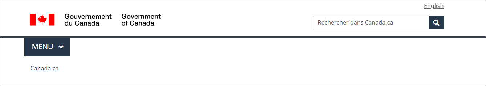

<h1 property="name" id="wb-cont" dir="ltr">Orientation dans Canada.ca: Résumé de recherche</h1>

Date: 21 décembre 2022

Les ministères et organismes gouvernementaux adoptent la conception de Canada.ca pour améliorer la confiance et la convivialité grâce à une expérience cohérente. La conception comprend des éléments de marque de base et des modèles de navigation. Les utilisateurs doivent pouvoir reconnaître rapidement les renseignements et les services officiels du gouvernement afin d’éviter les sites frauduleux. Ils ont également besoin de modèles intuitifs pour naviguer et accomplir leurs tâches.

L’un des principaux éléments de la marque est l’en-tête général, qui comprend un thème et un menu thématique. Ce menu comporte plusieurs lacunes. Le Bureau de la transformation numérique (BTN) a mené un ensemble d’études pour comprendre le rôle et les répercussions du menu sur la navigation dans le site.

  

    <figure class="gc-complex-img" role="group">
      <figcaption>
        

          
L’en-tête général comprenant le menu thématique

          
L’en-tête comprend la signature du gouvernement du Canada, un bouton Menu et un fil d’Ariane Canada.ca sur le côté gauche de l’écran. Sur le côté droit de l’écran se trouvent une bascule de langue et la barre de recherche Canada.ca.

        

      </figcaption>
    </figure>
  

<h2 id="comprendre_le_probleme">Comprendre le problème</h2>

L’orientation est la façon dont les utilisateurs évaluent où ils se trouvent dans un site Web et planifient un parcours à suivre. Sur Canada.ca, le menu est un moyen pour les utilisateurs de naviguer dans le site. Il présente des pages de niveau supérieur (thèmes) pour aider les utilisateurs à trouver des réponses et des services.

Alors que de nombreuses visites commencent à partir d’un résultat de moteur de recherche, le site Web doit prendre en charge la navigation, peu importe la façon dont un utilisateur accède au site. Cela est particulièrement important lorsque les utilisateurs commencent leur parcours sur la mauvaise page.

Certains ministères ont exprimé leurs réticences à adopter la conception de Canada.ca, car le menu ferait concurrence à leurs menus locaux existants ou n’offrirait aucun avantage en matière de navigation. Par exemple, Statistique Canada a un menu de statistiques qui reprend les mêmes thèmes qui sont présents dans le menu Canada.ca. Les prestations offertes par Anciens Combattants Canada ont des titres ressemblant à ceux que l'on trouve dans le menu thématique, mais il s'agit de prestations différentes.

Nous avons travaillé avec ces ministères et d’autres pour explorer les options de navigation et de conception afin de faciliter l’adoption de la conception de Canada.ca.

Les objectifs de cette étude approfondie étaient les suivants&nbsp;:

<ul>
  <li>explorer les façons possibles de remplacer le menu;</li>
  <li>ne pas nuire à la réussite des tâches existante sur les sites qui sont déjà passés à la conception Canada.ca;</li>
  <li>améliorer la navigation vers les tâches principales à partir de différents thèmes ou ministères.</li>
</ul>

Nous avons effectué deux grandes séries de tests de convivialité relative à l’exécution des tâches, et nous avons utilisé l’analyse Web pour éclairer nos sprints de conception. Tout comme l’ont fait les études, les analyses ont montré que le fil d’Ariane est plus utilisé que le menu&nbsp;:

<ul>
  <li>4,7 % des visites utilisent des fils d’Ariane</li>
  <li>2,6 % des visites utilisent le menu</li>
</ul>

Cela laisse entendre qu’il serait possible de remplacer le menu sans avoir d’incidence sur la réussite des tâches. Nous avons également remarqué que les gens utilisent souvent le menu pour se connecter à des comptes. Cela laisse supposer que la création d’un parcours de connexion différent pourrait réduire encore davantage l’utilisation du menu.

<h2 id="mesure_de_reference">Établir une mesure de référence</h2>

En 2019, l’étude initiale a établi une mesure de référence des tâches principales pour chaque ministère participant. La recherche a comparé des sites affichant la conception de Canada.ca à des sites de ministères ayant des conceptions différentes. À cette époque, Immigration, Réfugiés et Citoyenneté Canada (IRCC) avait adopté la conception de Canada.ca, contrairement à Agriculture et Agroalimentaire Canada (AAC), Anciens Combattants Canada (ACC) et Statistique Canada (StatCan).

Un total de 20 participants ont essayé 12 tâches de ces ministères pour nous aider à comprendre les lacunes du menu et pour nous donner des idées de solutions potentielles. Parmi les participants, on comptait les personnes suivantes&nbsp;:

<ul>
  <li>des étudiants étrangers;</li>
  <li>des agriculteurs;</li>
  <li>des vétérans;</li>
  <li>des universitaires.</li>
</ul>

L’étude a examiné des tâches typiques que les utilisateurs accomplissent dans chaque site ministériel, y compris un scénario qui commençait sur une page de résultats de recherche Google.

		

			
Liste de scénarios de tâches

  <table class="table table-striped table-bordered small">
    <caption>
    List of tasks scenarios
    </caption>
    <thead>
      <tr class="active">
        <th scope="col" class="col-sm-4">Tâche</th>
        <th scope="col" class="col-sm-8">Scénario</th>
      </tr>
    </thead>
    <tbody>
      <tr>
        <td>Commencez sur une page de résultats Google avec des liens vers des URL Canada.ca et vers d’autres sites (tâche de confiance)</td>
        <td>Votre ami de la France n’aura pas besoin de visa pour venir vous rendre visite, mais aura besoin d’une autorisation de voyage électronique. Combien lui en coûtera-t-il pour faire une demande?</td>
      </tr>
      <tr>
        <td>Commencez sur une page affichant la conception Canada.ca 
          Immigration, Réfugiés et Citoyenneté Canada (IRCC) pour le permis d’études (tâche de navigation dans un site ministériel)</td>
        <td>Yen a demandé une carte de résidente permanente et veut savoir si elle a déjà été envoyée par la poste. Trouvez une page où elle peut entrer son identifiant et son mot de passe pour accéder à son compte d’immigration.</td>
      </tr>
      <tr>
        <td>Allez à IRCC pour vérifier le statut (conception Canada.ca – tâche de connexion)</td>
        <td>veut savoir si elle a déjà été envoyée par la poste. Trouvez une page où elle peut entrer son identifiant et son mot de passe pour accéder à son compte d’immigration.</td>
      </tr>
      <tr>
        <td>Agriculture topic for temporary foreign workers (no Canada.ca design navigation between themes)</td>
        <td>You finished researching some ideas for the next farming season. Now you need to find out if there is a special way to hire temporary seasonal farm workers from Mexico.</td>
      </tr>
      <tr>
        <td>Sujet de l’agriculture pour les travailleurs étrangers temporaires (pas de navigation entre les thèmes propres à la conception Canada.ca)</td>
        <td>Vous avez fini de chercher des idées pour la prochaine saison agricole. Vous devez maintenant savoir s’il existe un moyen particulier d’embaucher des travailleurs agricoles saisonniers temporaires du Mexique.</td>
      </tr>
      <tr>
        <td>Site d’Agriculture Canada vers le sujet &laquo;&nbsp;agriculture&nbsp;&raquo; (pas de navigation thématique dans Canada.ca)</td>
        <td>Votre ami va commencer à cultiver du blé ce printemps en Saskatchewan. Y a-t-il une assurance-récolte là-bas?</td>
      </tr>
      <tr>
        <td>Site d’Agriculture Canada vers le sujet &laquo;&nbsp;agriculture&nbsp;&raquo; (pas de navigation thématique dans Canada.ca)</td>
        <td>Cet ami veut comprendre le marché du blé biologique à l’extérieur du Canada. Existe-t-il des rapports datant de 2019 et offrant un aperçu du commerce et des tendances de consommation qui pourraient l’aider?</td>
      </tr>
      <tr>
        <td>ACC (tâche interministérielle)</td>
        <td>Nour est un vétéran blessé qui gère son budget familial. Combien peut-elle s’attendre à recevoir si son conjoint Pat est reconnu comme son proche aidant?</td>
      </tr>
      <tr>
        <td>Site d’ACC vers l’allocation canadienne pour enfants (site d’ARC) 
          (navigation interthématique)</td>
        <td>Comme tous les parents canadiens, Pat et Nour reçoivent également des versements mensuels de l’allocation canadienne pour enfants pour leur fils de 15 ans. Recevront-ils toujours des paiements le mois prochain lorsqu’il aura 16 ans?</td>
      </tr>
      <tr>
        <td>Pages sur les aidants d’ACC vers un compte (pas d’expérience de connexion à Canada.ca)</td>
        <td>Nour vient de changer de banque. Est-il possible pour elle de modifier ses renseignements bancaires en ligne pour les versements d’ACC, ou doit-elle appeler le ministère?</td>
      </tr>
      <tr>
        <td>Navigation intraministérielle dans le site de StatCan 
          (supprimé dans la comparaison)</td>
        <td>Vous avez recherché et trouvé des rapports sur le soja, et vous avez maintenant besoin de données récentes. Trouvez la production estimée de soja en 2019 au Canada.</td>
      </tr>
      <tr>
        <td>Navigation intraministérielle dans le site de StatCan 
          (supprimé dans la comparaison)</td>
        <td>Vous avez un message vocal d’une personne prétendant être un intervieweur de Statistique Canada. La personne indique que votre ménage a été sélectionné pour répondre à l’Enquête sur la population active. Trouvez le numéro spécial que les participants à l’enquête peuvent appeler pour vérifier s’il s’agit d’une véritable enquête.</td>
      </tr>
      <tr>
        <td>Comparez avec le Royaume-Uni pour évaluer les options de conception 
          Coût du visa étudiant du gouvernement britannique 
          (supprimé dans la comparaison)</td>
        <td>Zak a été accepté dans un programme d’études de deux ans au Royaume-Uni. Combien lui en coûtera-t-il pour obtenir un visa étudiant? Commencez sur une page Gov.UK pour comparer l’expérience sur ce site avec une tâche semblable sur Canada.ca (uniquement pour la recherche, pas une tâche de mesure).</td>
      </tr>
    </tbody>
  </table>

L’étude de référence nous a donné un aperçu de solutions possibles aux problèmes rencontrés par les participants, ainsi que des taux de repérabilité et de réussite des tâches afin que nous puissions évaluer les conceptions proposées. Comme prévu, les participants ont eu de la difficulté à passer d’un thème à l’autre sur des sites n’utilisant pas la conception Canada.ca. Une autre lacune que cette étude a mise en évidence concerne l’absence d’un bouton de connexion classique.

<h2 id="efforts_de_conception">Efforts de conception</h2>

Pour tester des façons de remplacer le menu, nous avons élaboré ce qui suit&nbsp;: 

<ul>
  <li>un nouveau pied de page qui comprend des liens vers tous les thèmes, avec une bande contextuelle au-dessus;</li>
  <li>une conception stratifiée pour les pages thématiques avec un widget pour changer de thème facilement;</li>
  <li>un bouton de connexion pour promouvoir cette tâche principale.</li>
</ul>
<h3>Nouveau pied de page</h3>

L’analyse des modèles d’utilisation du pied de page sur la page d’accueil par rapport à toutes les autres pages a révélé une possibilité de réduire l’ensemble de liens de pied de page à l’échelle du GC à trois (&laquo;&nbsp;Tous les personnes-ressources&nbsp;&raquo;, &laquo;&nbsp;Ministères et organismes&nbsp;&raquo;, &laquo;&nbsp;À propos du gouvernement&nbsp;&raquo;). Cela a libéré de l’espace pour retirer les liens vers les pages thématiques du menu et les placer dans la bande principale du pied de page.

La nouvelle conception du pied de page a aussi permis d’ajouter une bande contextuelle facultative pour &laquo;&nbsp;Contactez-nous&nbsp;&raquo; et d’autres liens de dépannage contextuels.

  

    <figure class="gc-complex-img" role="group">
      <figcaption>
        

          
Le nouveau pied de page Canada.ca

          
 Le pied de page général comprend trois bandes de liens distinctes. La première est la nouvelle bande contextuelle. Elle contient un titre et trois liens contextuels sur une seule ligne. La deuxième est la bande principale. Elle est organisée en trois colonnes et contient des liens vers &laquo;&nbsp;Tous les personnes-ressources&nbsp;&raquo;, &laquo;&nbsp;Ministères et organismes&nbsp;&raquo; et &laquo;&nbsp;À propos du gouvernement&nbsp;&raquo;. Il y a une petite ligne décorative servant de démarcation avec les liens vers tous les thèmes et tous les publics. Le sous-pied de page se trouve au bas et contient des liens vers &laquo;&nbsp;Médias sociaux&nbsp;&raquo;, &laquo;&nbsp;Applications mobiles&nbsp;&raquo;, &laquo;&nbsp;À propos de Canada.ca&nbsp;&raquo;, &laquo;&nbsp;Avis&nbsp;&raquo; et &laquo;&nbsp;Confidentialité&nbsp;&raquo;. Ceux-ci sont tous alignés à gauche sur une seule ligne. Elle comprend également le mot-symbole &laquo;&nbsp;Canada&nbsp;&raquo; sur la même rangée, aligné à droite.

        

      </figcaption>
    </figure>
  

<h3>Nouveau modèle stratifié pour les pages thématiques</h3>

Nous avons également créé un nouveau modèle de page thématique stratifié accessible à la fois par les fils d’Ariane et le pied de page.

Le modèle de page thématique stratifié comporte une barre de navigation sur la gauche et une bande En demande dans la partie supérieure. Les sujets du thème se trouvent sous la bande En demande.

  

    <figure class="gc-complex-img" role="group">
      <figcaption>
        

          
Prototype de la conception d'une nouvelle page thématique (en anglais seulement)

          
La page thématique remaniée comporte une barre de navigation sur la gauche. Le côté droit de la page contient le nom du thème, les liens les plus demandés, et les sujets avec des descriptions.

        

      </figcaption>
    </figure>
  

<h3>Nouveau bouton de connexion contextuel</h3>

Les utilisateurs s’attendent généralement à trouver un bouton de connexion en haut à droite de la page. Ceci est courant sur de nombreux sites Web. C’est devenu une convention Web. Nous en avons ajouté un pour soutenir cette tâche principale.

  

    <figure class="gc-complex-img" role="group">
      <figcaption>
        

          
Nouvel en-tête avec le bouton contextuel facultatif &laquo;&nbsp;Se connecter.&nbsp;&raquo; 

          
Texte de remplacement : L’en-tête comprend la signature du gouvernement du Canada, un bouton Menu et un fil d’Ariane Canada.ca sur le côté gauche de l’écran. Sur le côté droit de l’écran se trouvent une bascule de langue, la barre de recherche Canada.ca et un bouton  &laquo;&nbsp;Se connecter.&nbsp;&raquo;

        

      </figcaption>
    </figure>
  

Une fois les différents éléments de la nouvelle conception définis, nous avons lancé une autre étude. Celle-ci nous a permis de vérifier l’efficacité du prototype et de peaufiner la stratégie de mise en œuvre.

<h2 id="mesure_du_succes">Mesure du succès</h2>

Contrairement à d’autres projets d’optimisation devant mener à de grandes améliorations, dans ce projet, nous cherchions à maintenir ou, préférablement, à augmenter la réussite des tâches malgré la suppression du menu et le passage à la conception de Canada.ca. Nous avons atteint notre objectif.

Un total de 18 participants ont essayé huit tâches sur les sites d’IRCC, d’AAC et d’ACC. Nous avons comparé leurs résultats avec ceux de l'étude de référence. Nous avons utilisé des prototypes avec les nouvelles conceptions que nous avions créées. Nous n’avons pas inclus de tâches de StatCan dans cette ronde parce que nous avions besoin de plus de temps pour expérimenter des façons de répondre à son besoin d’une solution de navigation locale. Nous voulions nous concentrer d’abord sur l’amélioration de la navigation globale, car cela était moins complexe. Nous avons également ajouté quatre nouvelles tâches pour évaluer et améliorer les nouvelles conceptions.

  

    

      <table class="table table-bordered small">
        <caption class="wb-inv">
        Evaluation of 2021 prototypes
        </caption>
        <thead>
          <tr class="brdr-tp active">
            <th scope="col" class="col-sm-6">Les résultats des tests</th>
            <th scope="col" class="col-sm-3 text-center">Étude de référence&nbsp;: 2019</th>
            <th scope="col" class="col-sm-3 text-center">Étude de comparaison&nbsp;: 2021</th>
          </tr>
        </thead>
        <tbody>
          <tr>
            <th scope="row" class="mrgn-lft-md">D’utilisateurs qui ont trouvé la bonne réponse (réussite globale des taches)</th>
            <td class="text-center">54&nbsp;%</td>
            <td class="text-center">61&nbsp;%</td>
          </tr>
          <tr>
            <th scope="row" class="mrgn-lft-md">D’utilisateurs qui ont trouvé la bonne page (repérabilité) </th>
            <td class="text-center">61&nbsp;%</td>
            <td class="text-center">66&nbsp;%</td>
          </tr>
        </tbody>
      </table>
    

  

L’application de la conception Canada.ca à des sites ministériels affichant d’autres conceptions a permis de maintenir ou d’améliorer la réussite des tâches. En ce qui concerne la tâche qui nécessitait de passer du site d’Anciens Combattants aux prestations pour enfants, il y a eu une grande amélioration. Pour les autres tâches nécessitant une navigation dans le même thème, les résultats de la comparaison étaient semblables à la mesure de référence.

<h2 id="ce_que_nous_avons_appris">Ce que nous avons appris</h2>

L’étude a montré qu’il est possible de supprimer le menu s’il est remplacé par le nouveau pied de page, le bouton de connexion et une conception stratifiée pour les pages thématiques. Il s’agit d’un changement important qui nécessite une stratégie de transition.

Lisez notre billet de blogue pour savoir comment nous déployons ce changement.

<a href="#">Le projet Orientation dans Canada.ca améliore notre approche en matière de la navigation</a>

Nous avons maintenu la réussite des tâches et aidé de nouveaux ministères à adopter la conception de Canada.ca.

<h2 id="pour_explorer_davantage">Pour explorer davantage</h2>
<ul>
  <li><a href="#">Le projet Orientation dans Canada.ca améliore notre approche en matière de la navigation</a>&nbsp;: un billet de blog qui décrit le déploiement de la nouvelle conception de la navigation sur Canada.ca</li>
  <li><a href="https://www.canada.ca/en/treasury-board-secretariat/services/government-communications/canada-content-information-architecture-specification/mandatory-elements.html">Éléments obligatoires du système de conception de Canada.ca</a>&nbsp;: modèles et configurations qui offrent une expérience cohérente aux visiteurs du site</li>
  <li><a href="https://blogue.canada.ca/pages/apercu-projet.html">Améliorer le contenu sur Canada.ca</a>&nbsp;: une liste d'autres projets que nous avons réalisés avec nos partenaires</li>
</ul>
<h2 id="communiquez">Communiquez avec le Bureau de la transformation numérique du Secrétariat du Conseil du Trésor du Canada</h2>

Contactez-nous si vous avez des questions ou si vous souhaitez voir les résultats de recherche détaillés de ce projet ou de l’étude sur la confiance.

<ul>
  <li>Courriel&nbsp;: <a href="mailto:dto-btn@tbs-sct.gc.ca">dto-btn@tbs-sct.gc.ca</a></li>
  <li>Twitter&nbsp;: #Canadapointca (français) / #Canadadotca (anglais)</li>
  <li>Slack&nbsp;: <a href="http://design-GC-conception.slack.com">http://design-GC-conception.slack.com</a></li>
</ul>
<h2 id="liste_de_diffusion">Abonnez-vous à la liste d’envoi du Bureau de la transformation numérique</h2>

  <form action="https://github.us12.list-manage.com/subscribe/post?u=5700d338d6ab413ebca1099f4&amp;id=c6bb0b9f64" method="post" id="mc-embedded-subscribe-form" name="mc-embedded-subscribe-form" class="col-sm-8 validate paddingc" target="_blank" novalidate>
    

      <fieldset class="gc-chckbxrdio">
        <legend>Format d'infolettre désirée</legend>
        <ul class="list-unstyled lst-spcd-2">
          <li class="radio">
            <input type="radio" value="html" name="EMAILTYPE" id="mce-EMAILTYPE-0">
            <label for="mce-EMAILTYPE-0">HTML</label>
          </li>
          <li class="radio">
            <input type="radio" value="text" name="EMAILTYPE" id="mce-EMAILTYPE-1">
            <label for="mce-EMAILTYPE-1">texte clair <small>(Nous recommandons 'texte clair' si votre pare-feu bloque les courriels HTML)</small></label>
          </li>
        </ul>
      </fieldset>
      

        

          <label class="wb-inv" for="mce-EMAIL">Votre courriel</label>
          <input type="email" value="" name="EMAIL" class="form-control required email" id="mce-EMAIL" placeholder="Votre courriel">
          
          <button type="submit" name="subscribe" id="mc-embedded-subscribe" class="btn btn-success nowrap">Abonnez-vous</button>
           

      

      

        

        

      

      <!-- real people should not fill this in and expect good things - do not remove this or risk form bot signups-->
      

        <input type="text" name="b_5700d338d6ab413ebca1099f4_c6bb0b9f64" tabindex="-1" value="">
      

    

  </form>

 
 
<!--End mc_embed_signup-->

 <a href="#privacy-notice-modal" aria-controls="privacy-notice-modal" class="overlay-lnk light-link wb-lbx" aria-label="Privacy Statement Link">Énoncé de confidentialité</a> 

<section class="mfp-hide modal-dialog modal-content overlay-def" id="privacy-notice-modal">
  <header class="modal-header">
    <h2 class="modal-title">Énoncé de confidentialité</h2>
  </header>
  

    
Notre fonction Bulletin de nouvelles fait appel &agrave; <a href="https://mailchimp.com/">Mailchimp</a>, une application tierce. L'adh&eacute;sion est libre et est assujettie aux <a href="https://mailchimp.com/legal/terms/">Conditions d'utilisation</a> associ&eacute;es &agrave; la plateforme Mailchimp. Au moment de l'adh&eacute;sion, le syst&egrave;me enregistre votre adresse &eacute;lectronique et votre langue de pr&eacute;f&eacute;rence (anglais ou fran&ccedil;ais). Aucun autre renseignement personnel n'est recueilli.

    
La collecte et l'utilisation de vos renseignements personnels sont autoris&eacute;es par la <em>Loi sur la gestion des finances publiques</em>. La collecte et l'utilisation de vos renseignements personnels aux fins du pr&eacute;sent site sont conformes &agrave; la <em>Loi f&eacute;d&eacute;rale sur la protection des renseignements personnels</em>. Vos renseignements personnels peuvent servir &agrave; r&eacute;pondre &agrave; vos demandes de renseignements, au besoin, et &agrave; &eacute;valuer l'efficacit&eacute; avec laquelle les programmes du Secr&eacute;tariat du Conseil du Tr&eacute;sor (SCT) r&eacute;pondent aux besoins des clients. Dans des cas exceptionnels (p. ex., le cas de quelqu'un qui fait des remarques inappropri&eacute;es ou des menaces), les renseignements personnels peuvent &ecirc;tre divulgu&eacute;s sans votre consentement conform&eacute;ment au paragraphe 8(2) de la <em>Loi sur la protection des renseignements personnels</em>.

    
Tout renseignement personnel qui pourra &ecirc;tre recueilli est d&eacute;crit dans le Fichier de renseignement personnel ordinaire intitul&eacute; <a href="http://www.infosource.gc.ca/emp/emp03-fra.asp#psu938">Activit&eacute;s de sensibilisation, POU 938</a> qui figure sur la page Web du SCT intitul&eacute;e <a href="https://www.canada.ca/fr/secretariat-conseil-tresor/services/acces-information-protection-reseignements-personnels/acces-information/renseignements-programmes-fonds-renseignements/fichiers-renseignements-personnels-ordinaires.html"><em>Renseignements sur les programmes et les fonds de renseignements</em></a>.

    
Pour transmettre vos questions, commentaires ou pr&eacute;occupations concernant le pr&eacute;sent avis, vos droits en mati&egrave;re de protection des renseignements personnels ou la <em>Loi sur la protection des renseignements personnels</em>, communiquez avec le coordonnateur de l&rsquo;acc&egrave;s &agrave; l&rsquo;information et de la protection des renseignements personnels du SCT, &agrave; <a href="mailto:atip.aiprp@tbs-sct.gc.ca">atip.aiprp@tbs-sct.gc.ca</a>, ou en composant le 1-866-312-1511. Vous pouvez aussi communiquer avec le Commissariat &agrave; la protection de la vie priv&eacute;e du Canada par courriel, &agrave; <a href="mailto:info@priv.gc.ca">info@priv.gc.ca</a>, ou par t&eacute;l&eacute;phone, au 1-800-282-1376. Vous avez &eacute;galement la possibilit&eacute; de d&eacute;poser une plainte aupr&egrave;s du Commissariat &agrave; la protection de la vie priv&eacute;e du Canada quant &agrave; la fa&ccedil;on dont le SCT traite vos renseignements personnels.

  

</section>
